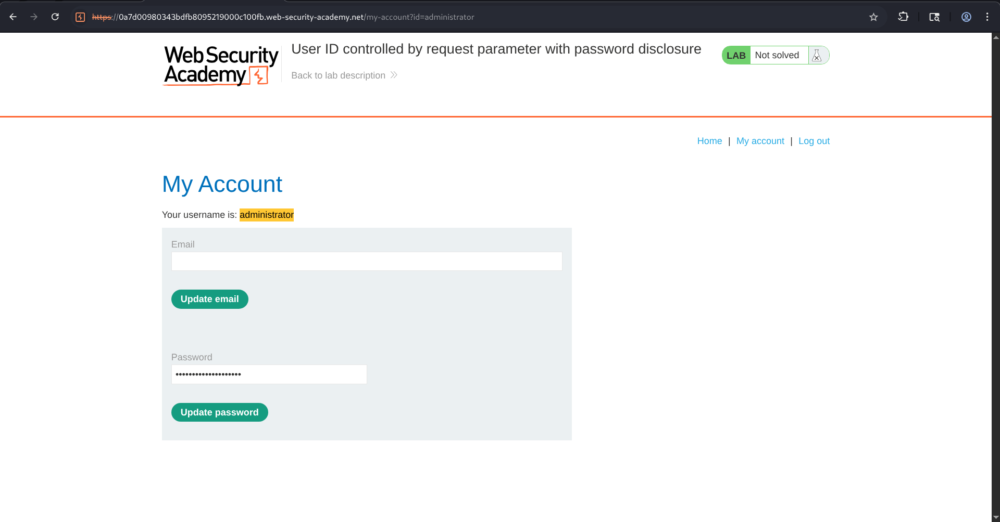
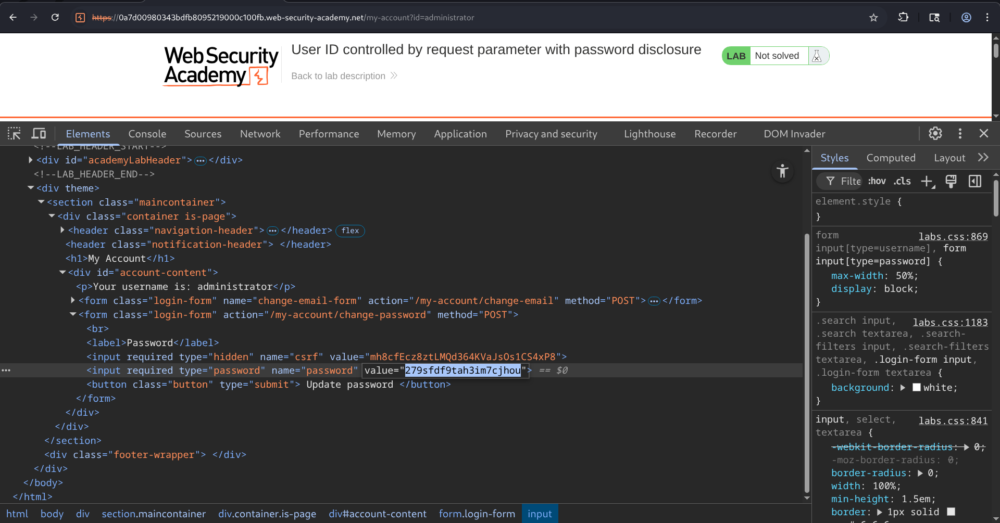
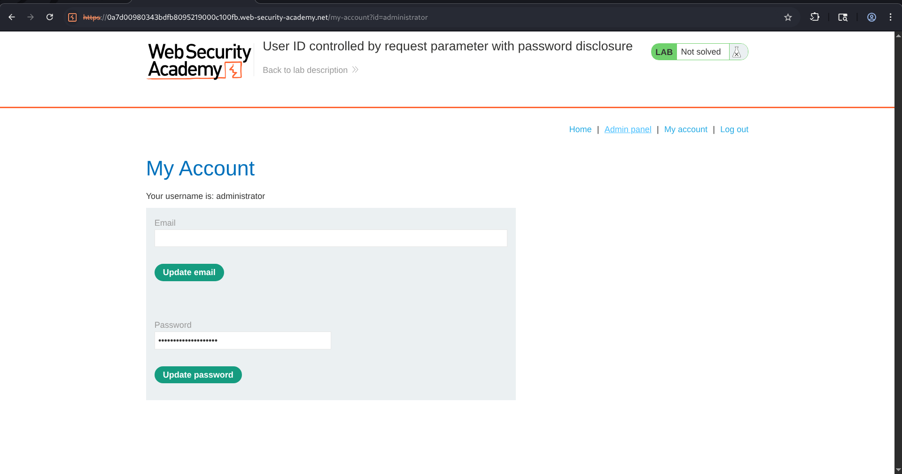
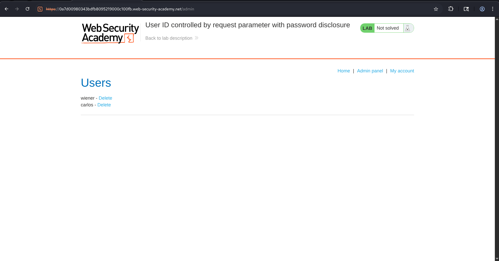
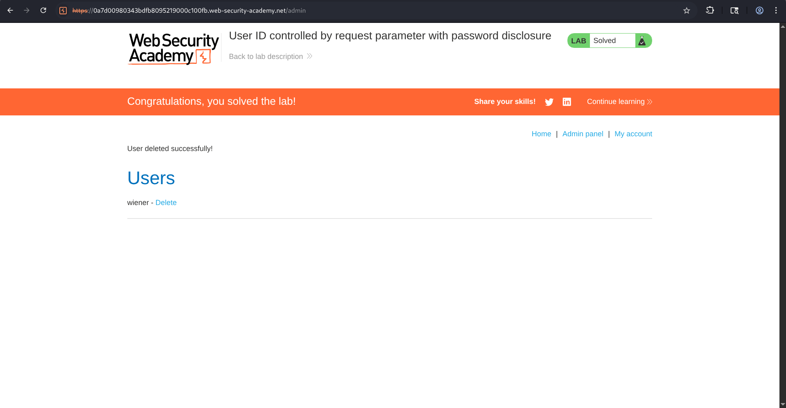

# User ID Controlled by Request Parameter with Password Disclosure

## Overview

This lab demonstrates an Access Control vulnerability caused by insecure handling of user identifiers within request parameters. The application exposes user account information based solely on a user-controlled parameter without performing proper authorization checks.

Using this vulnerability, it is possible to obtain administrator credentials, authenticate as the administrator, access the administrative interface, and perform privileged actions.

---

## Lab Objective

The objective of this lab is to gain administrative access to the application and delete the user **carlos** by exploiting the password disclosure vulnerability.

---

### Lab Environment : 

**Provided Credentials:**

- Username: `wiener`
- Password: `peter`

---

## Methodology

### Step 1: Authenticate as a Normal User

The application provided valid credentials for a standard user account.

After successful authentication, the account page became accessible.


---

### Step 2: Analyze Account Functionality

While viewing the account page, I observed that the application used a request parameter to determine which user's information should be displayed.

Which is :

```

/my-account?id=wiener

```

---

### Step 3: Manipulate the User Identifier

The value of the account identifier parameter was modified from:

**wiener**  to:   **admin**

and later:

**administrator**

The application responded by loading the administrator's account page.

This demonstrated that account data could be accessed by simply changing the request parameter. On loading the administrator account page, the password field appeared masked within the user interface.




---

### Step 4: Extract Administrator Credentials

However, inspecting the page source revealed that the password value was embedded directly within the HTML response. So, I just copied directly from the HTML source code.



---

### Step 5: Login as Administrator

Using the disclosed credentials, authentication was performed as the administrator.

Successful login granted access to administrative functionality.



---

### Step 6: Access Administrative Interface

After logging in as the administrator, the administrative panel became accessible.

Administrative privileges allowed management of user accounts.



---

### Step 7: Delete Carlos User

The user **carlos** was located in the administrative panel and deleted.

Upon deletion, the lab was successfully solved.



---

## Attack Flow

1. Login using provided user credentials.
2. Access the account page.
3. Identify that account information is controlled by a user-supplied parameter.
4. Modify the parameter value to reference another user.
5. Access the administrator account page.
6. Inspect the page source.
7. Extract the administrator password from the HTML response.
8. Authenticate as administrator.
9. Access the admin panel.
10. Delete the user Carlos.
11. Lab solved.

---

## Impact

This vulnerability can have severe security consequences:

### ▨ Unauthorized Access to User Accounts

Attackers can access account information belonging to other users simply by modifying request parameters.

### ▨ Credential Disclosure

Sensitive credentials can be exposed directly within application responses, leading to account compromises.

### ▨ Privilege Escalation

Attackers can obtain administrator credentials and elevate their privileges within the application.

### ▨ Administrative Compromise

Administrative functions become accessible to unauthorized users, allowing them to modify, delete, or manipulate sensitive data.

### ▨ Data Breach

Exposure of account information may lead to disclosure of personal, financial, or business-sensitive information.

---

## Security Recommendations

### ◈ Implement Server-Side Authorization Checks

Authorization decisions must never rely on client-supplied parameters alone.

The server should verify that the authenticated user is authorized to access the requested resource.

---

### ◈ Enforce Object-Level Access Control

Every request referencing user-specific resources should validate ownership before returning data.

---

### ◈ Avoid Exposing Sensitive Information

Passwords should never be included within HTML responses, hidden fields, source code, or client-side scripts.

---

### ◈ Store Passwords Securely

Passwords should be stored using strong one-way hashing algorithms such as:

- Argon2
- bcrypt
- PBKDF2

Plaintext password storage should never be used.

---

### ◈ Conduct Security Testing

Regular assessments should be performed to identify:

- IDOR vulnerabilities
- Access control weaknesses
- Sensitive data exposure issues

---

## Conclusion

The lab demonstrates how insecure direct object references combined with sensitive information disclosure can result in full administrative compromise.

By modifying a user-controlled request parameter, it was possible to access the administrator account page. Inspection of the page source revealed the administrator password, enabling authentication as the administrator and access to privileged functionality.