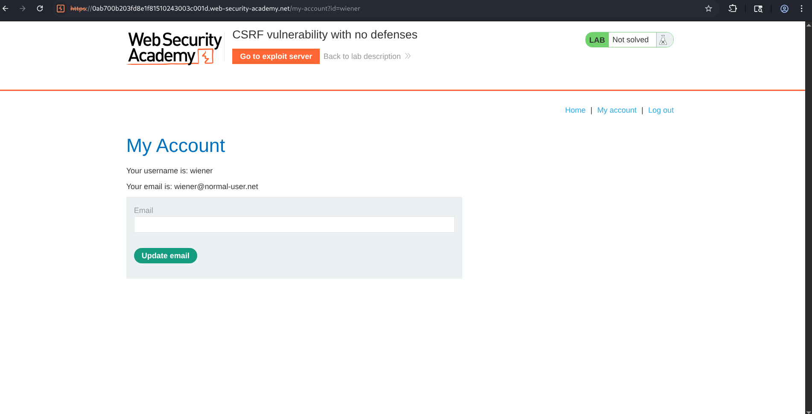
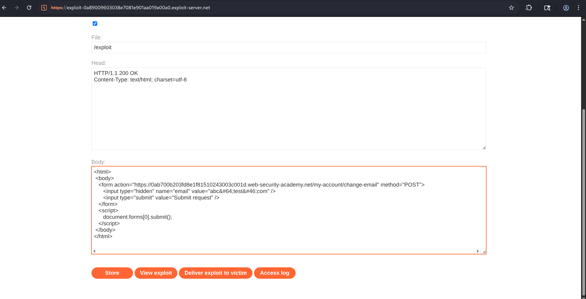
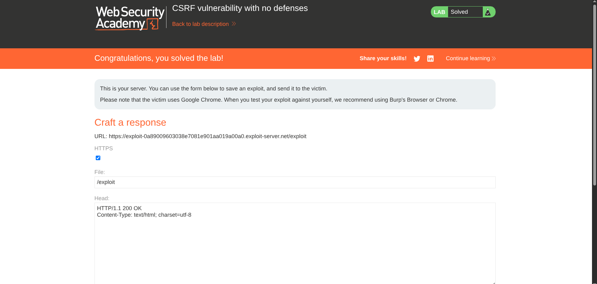

# Lab Report: CSRF Vulnerability with No Defenses

## Overview

Cross-Site Request Forgery (CSRF) is a web security vulnerability that allows an attacker to trick an authenticated user into performing unintended actions on a web application. Since browsers automatically include session cookies with requests, a malicious website can submit requests on behalf of the victim without their knowledge if the application lacks proper CSRF protections.

In this lab, the application allows authenticated users to change their email address through a POST request without validating the request's origin or verifying a CSRF token. By crafting a malicious HTML page containing an auto-submitting form, it is possible to force the victim's browser to submit the request automatically.

---

## Objective

The objective of this lab was to :

- Understand how CSRF attacks work.
- Identify the vulnerable email update functionality.
- Generate a CSRF Proof of Concept using Burp Suite Community Edition.
- Upload the exploit to the provided exploit server.
- Deliver the exploit to the victim.

The lab states :

> "To solve the lab, craft some HTML that uses a CSRF attack to change the viewer's email address and upload it to your exploit server."

which means, the application performs no validation against forged requests, making it vulnerable to a basic CSRF attack.

---

## Methodology

### Step 1 - Login

Logged into the application using the provided credentials.

```
Username: wiener
Password: peter
```

---

### Step 2 - Locate the Email Update Functionality

Navigated to **My Account** and identified the form used to update the email address.

The form submits a POST request to :

```
/my-account/change-email
```



---

### Step 3 - Capture the Request

Captured the email update request using Burp Suite.
Then, found out..

- Request method is POST
- No CSRF token is present
- Cookies authenticate the request
- Only the email parameter is required

indicates the endpoint is vulnerable to CSRF.

---

### Step 4 - Generate the CSRF Proof of Concept

Then, I wrote the  **CSRF PoC** ( an HTML page containing a hidden form that submits automatically) myself since this was community edition. 

containing :

- hidden email parameter
- POST request
- JavaScript auto-submit


```html
<form action="/my-account/change-email" method="POST">
    <input type="hidden" name="email" value="attacker@test.com">
</form>

<script>
document.forms[0].submit();
</script>
```



---

### Step 5 - Deliver the Exploit

After storing the payload...
 clicked **Deliver exploit to victim**

The exploit server caused the victim's browser to automatically execute the hidden POST request.

Since the browser automatically included the victim's session cookie, the application processed the request as legitimate.

The victim's email address was successfully changed.

---

### Step 6 - Lab Solved

After the forged request was processed successfully, the lab status changed to :
**Solved**




---

> ### Vulnerability Explanation

The application allows users to update their email address using a POST request.

Because the application does **not** :

- validate the Origin header
- validate the Referer header
- require a CSRF token
- implement SameSite cookie protections,

the browser automatically sends the authenticated session cookie along with the forged request.

As a result, if the victim visits an attacker-controlled webpage containing an auto-submitting form, their browser unknowingly performs the email update request.

---

## Attack Flow

```
Victim logs into application
            ⇓
Victim session cookie stored
            ⇓
Victim visits attacker-controlled webpage
            ⇓
Auto-submitting HTML form executes
            ⇓
Browser automatically includes session cookie
            ⇓
POST request reaches vulnerable server
            ⇓
Server processes request
            ⇓
  Victim email changed
```

---

## Security Impact

A successful CSRF vulnerability can allow attackers to perform unauthorized actions on behalf of authenticated users.

Possible impacts include :

- Changing account email addresses
- Updating profile information
- Initiating financial transactions
- Adding or deleting resources
- Performing administrative actions
- Account takeover (combined with email change)

---

## Security Recommendations

The vulnerability can be mitigated using multiple defensive mechanisms :

### 1. Implement CSRF Tokens

Generate a unique, unpredictable CSRF token for every authenticated session and validate it on every state-changing request.

---

### 2. Validate Origin Header

Reject requests whose `Origin` header does not match the application's trusted domain.

---

### 3. Validate Referer Header

Use the Referer header as an additional validation mechanism when appropriate.

---

### 4. Require User Re-authentication

For sensitive actions such as :

- password changes
- email changes
- MFA changes

require the user to enter their password again.

---

### 5. Use Secure Cookie Attributes

Configure cookies with :

- Secure
- HttpOnly
- SameSite

---

## Conclusion

This lab demonstrated how the absence of CSRF defenses allows attackers to exploit authenticated users by forcing their browsers to submit unintended requests.

By analyzing the email update functionality, generating a CSRF Proof of Concept, uploading it to the exploit server, and delivering it to the victim, the email update request was successfully executed without any user interaction.


---

**References ~**

- OWASP Cross-Site Request Forgery (CSRF)
- PortSwigger Web Security Academy – CSRF Vulnerability with No Defenses
- OWASP Web Security Testing Guide (WSTG)
- CWE-352: Cross-Site Request Forgery