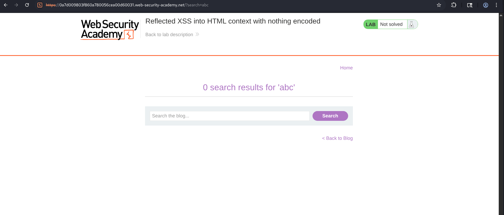
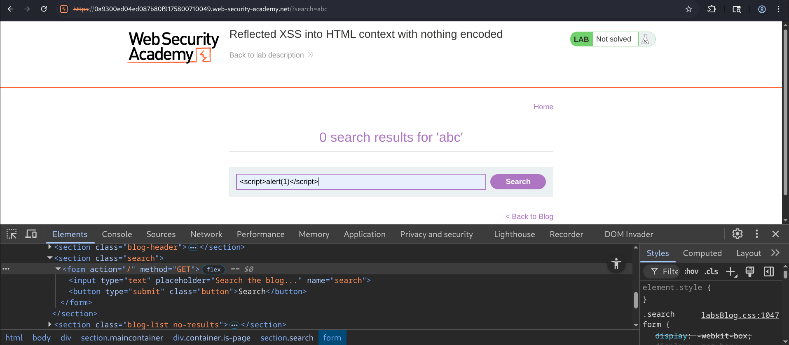
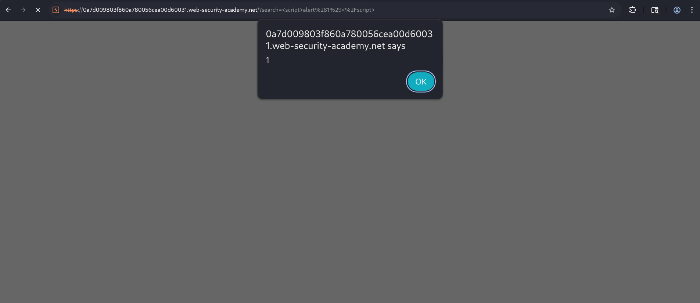
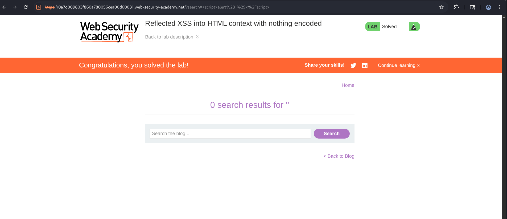

# Reflected XSS into HTML Context with Nothing Encoded

## Overview

This lab demonstrates one of the most basic forms of **Reflected Cross-Site Scripting (XSS)**.

The application contains a search functionality that reflects user input directly into the HTML response without performing any output encoding or sanitization. Because the application inserts the supplied input directly into the page, an attacker can inject arbitrary JavaScript that executes in the victim's browser.

Since the payload is reflected immediately in the server response and is not stored anywhere, this vulnerability is categorized as **Reflected XSS**.

---

## Objective

The objective of this lab is to identify a reflected XSS vulnerability in the search functionality and execute arbitrary JavaScript by injecting a malicious payload into the search parameter.

---

## Methodology

### Step 1 - Inspect the Search Functionality

The application contains a search box that accepts user input. So, i just put a  simple search string at first.

Which's :  **abc**



This confirms that the search term is reflected back inside the HTML page.

---

### Step 2 - Test for Reflection

Since the search input appeared directly inside the response, the next step was to determine whether special characters were encoded.

So, I go for 

```html
<script>alert(1)</script>
```



The payload was injected through the search parameter.

---

### Step 3 - Observe the Response

The application reflected the payload exactly as it was submitted, No HTML escaping occurred.


As a result, the browser interpreted the injected code as legitimate HTML and executed the JavaScript.


---

### Step 4 - Trigger JavaScript Execution

Once the page loaded, the browser executed:

```javascript
alert(1)
```

The JavaScript alert box appeared immediately.

The successful execution confirmed the presence of a **Reflected XSS vulnerability**.

The lab was then marked as solved.



---

## Attack Flow

```
       Attacker
          ⇓
Inject malicious JavaScript
into search parameter
          ⇓
Application reflects input
without encoding
          ⇓
Browser parses injected
<script> tag
          ⇓
JavaScript executes
inside victim browser
          ⇓
Reflected XSS Successful
```
---

## Impact

A successful Reflected XSS attack may allow  attacker to :

- Execute arbitrary JavaScript
- Steal active session cookies
- Hijack authenticated user sessions
- Capture sensitive information
- Modify page content
- Redirect users to phishing websites
- Perform browser-based attacks.. 

Although, reflected payloads are not stored permanently, but they become dangerous when victims are tricked into clicking specially crafted URLs.

---

## Root Cause

The vulnerability exists because:

- User input is reflected directly into the HTML response.
- No output encoding is applied.
- HTML special characters are not escaped.
- Browser interprets attacker-controlled input as executable code.

---

## Security Recommendations

### 1. Perform Context-Aware Output Encoding

Encode all user-controlled data before rendering it inside HTML.

like :

```
<  →  &lt;
>  →  &gt;
"  →  &quot;
'  →  &#39;
```

---

### 2. Validate User Input

Reject unnecessary HTML tags and dangerous characters where appropriate.

---

### 3. Use a Strong Content Security Policy (CSP)

Implement CSP headers to reduce the impact of injected scripts.

```
Content-Security-Policy:
default-src 'self';
script-src 'self';
object-src 'none';
```

---

### 4. Avoid Direct HTML Injection

Use secure templating engines that automatically escape user input.

---

### 5. Sanitize HTML When Necessary

If HTML input is required, sanitize it using trusted libraries instead of rendering raw input.

---

## Conclusion

This lab successfully demonstrated a **Reflected Cross-Site Scripting (XSS)** vulnerability caused by reflecting user-supplied input directly into the HTML response without any encoding or sanitization. By injecting the payload `<script>alert(1)</script>`, arbitrary JavaScript executed within the browser, confirming the vulnerability. 