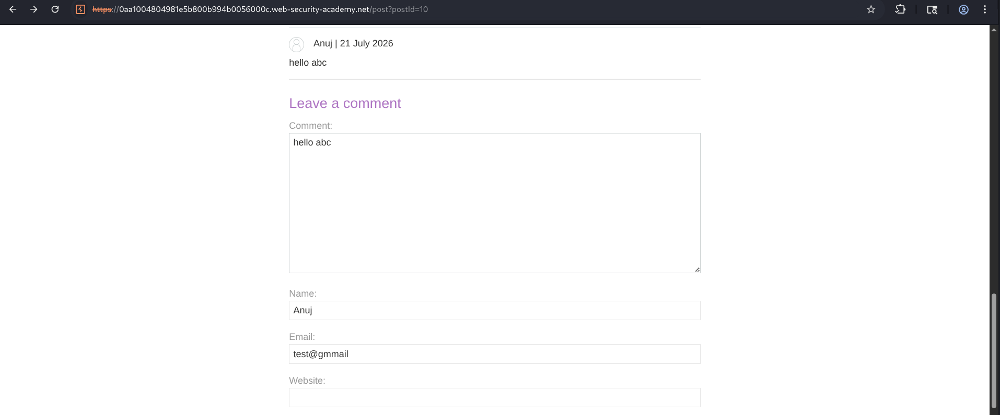
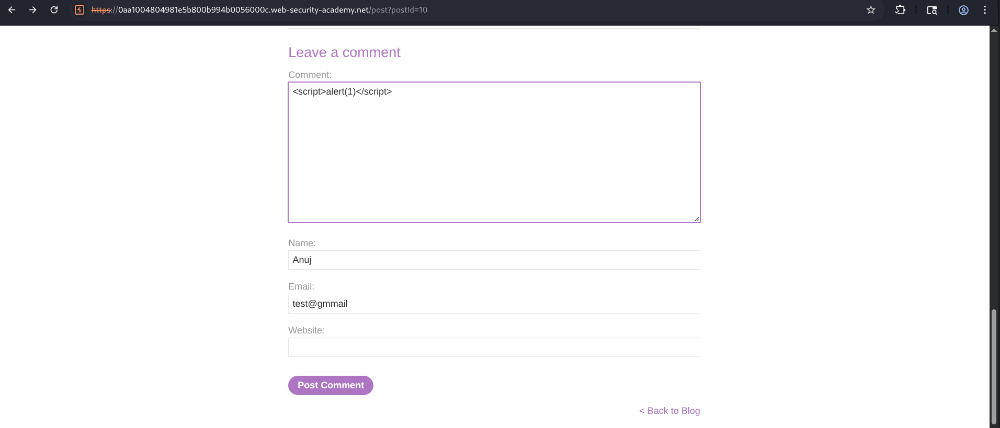
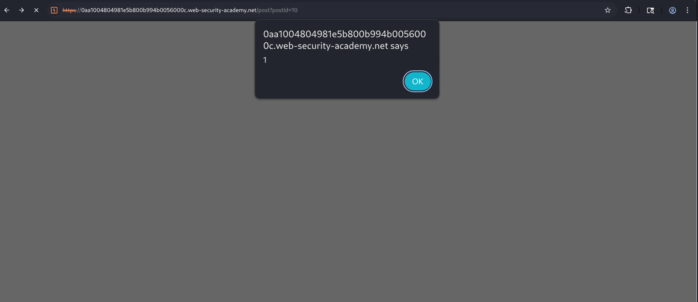
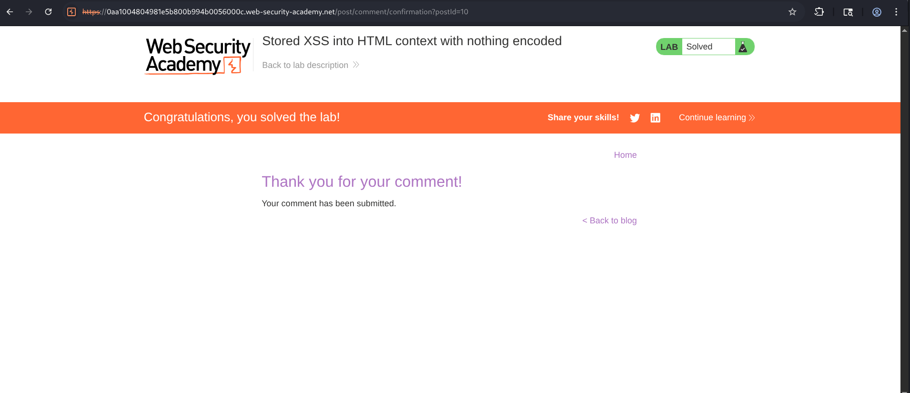

# Stored XSS into HTML Context with Nothing Encoded

## Overview

This lab demonstrates a classic **Stored Cross-Site Scripting (Stored XSS)** vulnerability where user-supplied input is permanently stored by the application and later rendered to every visitor without any output encoding or sanitization.

The application provides a blog with a comment section. User comments are saved by the server and displayed whenever the blog post is viewed. Since the application directly inserts the comment into the HTML page without escaping special characters, an attacker can inject arbitrary JavaScript that executes whenever another user loads the page.

---

## Objective

The objective of this lab is to identify a Stored XSS vulnerability in the blog comment functionality and inject a JavaScript payload that is permanently stored by the application and executed when the page is viewed.

Successfully executing the stored payload solves the lab.

---

## Methodology

### Step 1 - Inspect the Blog Comment Functionality

A blog articles section was opened with 4-5 blogs on diff topics, and when i clicked on one of them, at the end of which a comment section is given.

To understand how the application handled user input, I submitted a normal comment.

**hello abc**



---

### Step 2 - Identify the Injection Point

After submission, the comment appeared publicly on the blog page, which confirmed that comments were being stored on the server.

And since the application stored user comments permanently, it became a potential target for Stored XSS testing.

---

### Step 3 - Inject the XSS Payload

So, I entered :

```html
<script>alert(1)</script>
```


and the remaining fields were filled with valid information:

- Name
- Email
- Website (optional)

The comment was then submitted.

---

### Step 4 - Observe the Stored Response

After the comment was accepted, the application redirected back to the blog post.

Instead of displaying the payload as plain text, the browser interpreted the injected `<script>` tag as executable JavaScript.



An alert dialog appeared immediately.

---

### Step 5 - Verify Persistent Execution

Since the payload was stored by the server, every subsequent visit to the affected blog post caused the malicious JavaScript to execute again.

This confirmed the presence of a **Stored XSS** vulnerability.

And with that the lab was successfully marked as solved.


---

## Attack Flow

```
      Attacker
         ⇓
  Submit malicious comment
         ⇓
   Application stores comment
   inside database
         ⇓
  Victim visits blog page
         ⇓
  Stored comment rendered
  without encoding
         ⇓
   Browser interprets
   <script> tag
         ⇓
   JavaScript executes
  inside victim browser
         ⇓
  Stored XSS Successful
```
---

## Impact

Stored XSS vulnerabilities are among the most severe client-side vulnerabilities because they execute automatically for every user viewing the affected content.

That's why a successful attacker can...

- Execute arbitrary JavaScript in victims' browsers
- Hijack authenticated user sessions
- Steal session cookies
- Perform actions on behalf of users
- Redirect users to phishing websites

---

## Root Cause

The vulnerability exists because:

- User comments are stored without sanitization.
- Stored data is rendered directly into the HTML response.
- No output encoding is applied.
- User-controlled input is trusted by the application.

---

## Security Recommendations

### 1. Perform Context-Aware Output Encoding

Encode all user-generated content before rendering it inside HTML.

like..

```
<  →  &lt;
>  →  &gt;
"  →  &quot;
```

---

### 2. Sanitize User Input

If HTML formatting is unnecessary, remove dangerous tags such as :

- `<script>`
- `<iframe>`
- `<object>`
- `<embed>`
- `<svg>`

Use trusted sanitization libraries such as DOMPurify when HTML must be supported.

---

### 3. Implement a Strong Content Security Policy (CSP)

Restrict the execution of unauthorized JavaScript,
like..

```
Content-Security-Policy:
default-src 'self';
script-src 'self';
object-src 'none';
```

---

### 4. Validate User Input

Reject dangerous characters and unexpected HTML where appropriate.

---

### 5. Escape Stored Content Before Display

Always encode stored database content before rendering it into web pages.

---

## Conclusion

This lab successfully demonstrated a **Stored Cross-Site Scripting (Stored XSS)** vulnerability caused by storing user-supplied input and rendering it back into the HTML response without any encoding or sanitization. 

By submitting the payload `<script>alert(1)</script>` through the blog comment form, the application permanently stored the malicious script, which executed automatically whenever the affected page was viewed. This illustrates the high severity of Stored XSS vulnerabilities and emphasizes the need for context-aware output encoding, input sanitization, and Content Security Policy (CSP) to protect web applications from persistent client-side attacks.