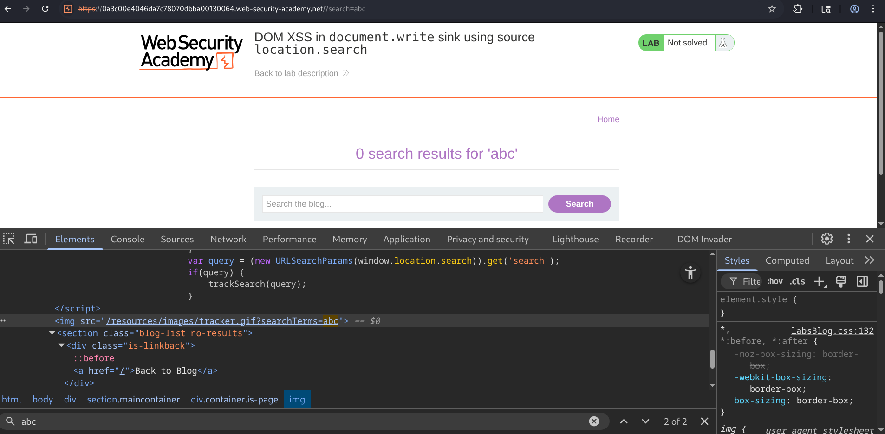
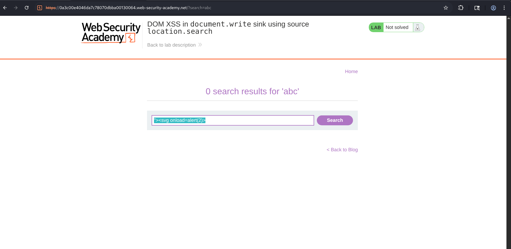
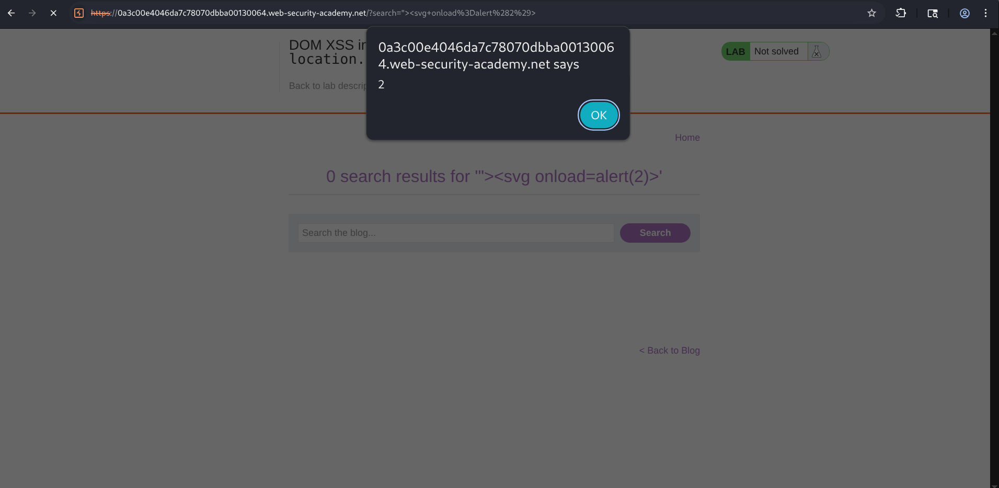

# Lab Report: DOM XSS in `document.write` Sink Using Source `location.search`

## Overview

This lab demonstrates a **DOM-Based Cross-Site Scripting (DOM XSS)** vulnerability where client-side JavaScript reads user-controlled input from the URL query string (`location.search`) and writes it directly into the HTML document using the dangerous `document.write()` function.

Unlike Reflected or Stored XSS, the malicious payload is never processed by the server. Instead, the browser itself executes the injected JavaScript after the vulnerable client-side code manipulates the DOM.

In this lab, the search parameter from the URL is inserted into an HTML attribute without proper sanitization. By breaking out of the existing attribute using a double quote (`"`), it becomes possible to inject a malicious SVG element containing an `onload` event, resulting in arbitrary JavaScript execution.

---

## Objective

The objective of this lab was to:

- Identify the DOM XSS vulnerability.
- Determine how user input flows from `location.search`.
- Analyze the vulnerable JavaScript behavior.
- Escape the existing HTML attribute.
- Inject an SVG element with an executable event handler.
- Trigger JavaScript execution.
- Successfully solve the PortSwigger lab.

---

## Methodology

### Step 1 - Understanding the Vulnerability

The first step was testing whether the application reflected user input.

So, I entered a simple search term :

**abc**

Then, page displayed the search results for the supplied value(empty).



---

### Step 2 - Inspecting the DOM

Then, I inspected generated HTML, and the search parameter was found inside the HTML..

```html

```

which shows :

- the search parameter originates from `location.search`
- it is inserted directly into an HTML attribute
- the application is vulnerable to attribute injection

### Step - 3 Vulnerability Analysis
Now, since the input resides inside a quoted attribute, injecting HTML directly won't work.

I have to first terminate the existing attribute. So, firstly I'll use this **">**, which will terminate the `src` attribute.

then, arbitrary HTML elements can be introduced into the page.

```html
<svg onload=alert(2)>
```

So, as we know, SVG supports JavaScript event handlers such as `onload`, which execute immediately when the element loads.



---

### Step 4 - Successful Exploitation

Once the payload executed, the browser displayed the JavaScript alert, which means successful DOM XSS exploitation.



The lab was then marked as solved.


---

## Attack Flow

```
  User Input
      ⇓
location.search
      ⇓
JavaScript reads URL parameter
      ⇓
document.write()
      ⇓
Input inserted into HTML attribute
      ⇓
Attacker closes attribute
      ⇓
Injects SVG element
      ⇓
Browser parses HTML
      ⇓
onload Event Executes
      ⇓
 JavaScript Runs
```

---

## Root Cause

The vulnerability exists cuz :

- User-controlled input is read directly from `location.search`.
- The application inserts input into the DOM using `document.write()`.
- No HTML encoding is applied.

---

## Security Impact

A successful attacker could :

- Execute arbitrary JavaScript.
- Hijack authenticated user sessions.
- Perform actions on behalf of users.
- Conduct phishing attacks.
- Capture sensitive user input.
- Redirect victims to malicious websites.

---

## Security Recommendations

### » Avoid `document.write()`

Replace dangerous DOM APIs with safer alternatives such as:

- `textContent`
- `createElement()`
- `appendChild()`

---

### » Encode User Input

Always perform context-aware output encoding before inserting user-controlled data into HTML.

---

### » Sanitize Input

Use robust HTML sanitization libraries (such as DOMPurify) when rendering user-generated HTML is required.

---

### » Validate Input

Restrict accepted characters and reject unexpected HTML where appropriate.

---

### » Implement Content Security Policy (CSP)

Deploy a strict Content Security Policy to reduce the impact of injected scripts.

```http
Content-Security-Policy:
default-src 'self';
script-src 'self';
object-src 'none';
```

---

### » Avoid Inline Event Handlers

Don't rely on HTML event attributes like...

- `onclick`
- `onload`
- `onerror`

Prefer JavaScript event listeners instead.

---

## Conclusion

This lab demonstrated how DOM-Based XSS can occur when client-side JavaScript directly processes URL parameters and inserts them into the page using `document.write()` without proper encoding.

By inspecting the generated HTML, identifying the vulnerable `img` element, escaping the existing attribute with a double quote, and injecting an SVG element containing an `onload` event handler, arbitrary JavaScript execution was successfully achieved.