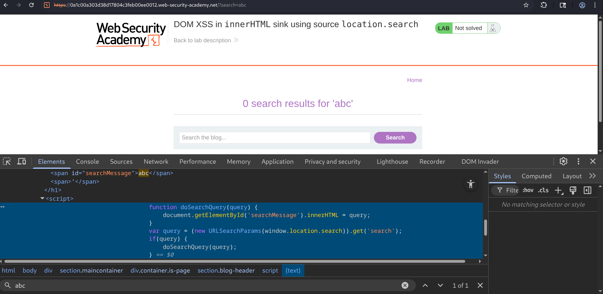
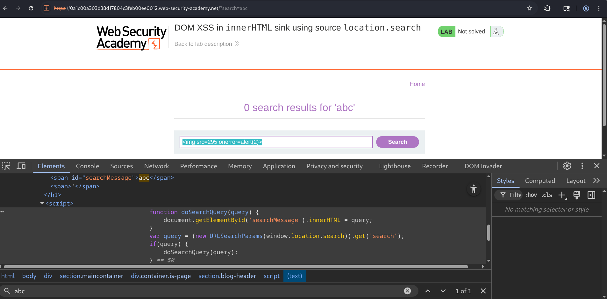

# Lab Report: DOM XSS in `innerHTML` Sink Using Source `location.search`

## Overview

This lab demonstrates a **DOM-Based Cross-Site Scripting (DOM XSS)** vulnerability where user-controlled input from the URL query string (`location.search`) is directly inserted into the webpage using the `innerHTML` property.

The server never processes or stores the payload. Instead, the browser executes vulnerable client-side JavaScript that reads the search parameter and writes it into the DOM. Since `innerHTML` parses supplied data as HTML, an attacker can inject arbitrary HTML elements.


---

## Objective

The objective of this lab was to :

- Identify the DOM XSS vulnerability.
- Determine how the search parameter flows into the DOM.
- Inspect the vulnerable JavaScript.
- Inject a malicious HTML element using an event handler.
- Trigger arbitrary JavaScript execution.

---

## Methodology

### Step 1 - Initial Reconnaissance

I entered just a normal search term( just as a test) :




---

### Step 2 - Inspecting the Client-side Code

After confirming the reflection, the page source was inspected using Developer Tools.

JavaScript was identified :

```JS
function doSearchQuery(query) {
    document.getElementById('searchMessage').innerHTML = query;
}

var query = (new URLSearchParams(window.location.search)).get('search');

if(query){
    doSearchQuery(query);
}
```

which shows :

- User input originates from `location.search`.
- The value is passed directly into `innerHTML`.
- No sanitization or encoding is performed.

---

### Step - 3 Vulnerability Analysis

Initially, I considered standard `<script>` payload :

```html
<script>alert(2)</script>
```

but, the modern browsers don't execute **`<script>`** elements inserted through `innerHTML`. Since, the browser still parses HTML attributes and event handlers, a different approach was required.

So, I used an image element with an invalid source so that, when the browser fails to load the image, the `onerror` event automatically executes.

```html

```


---

### Step 4 - Successful Exploitation

The injected `onerror` event successfully executed JavaScript, proving arbitrary code execution inside the browser.


The lab was then marked as solved.


---

## Attack Flow

```
Attacker Input
      ⇓
URL Query Parameter
(location.search)
      ⇓
JavaScript Reads Input
      ⇓
query Variable
      ⇓
innerHTML Assignment
      ⇓
Browser Parses HTML
      ⇓
Injected  Element Created
      ⇓
Invalid Image Source
      ⇓
onerror Event Triggered
      ⇓
JavaScript Executes
```

---

## Root Cause

The vulnerability exists because:

- Untrusted input is read directly from `location.search`.
- User input is inserted into the page using `innerHTML`.
- No output encoding is performed.
- No HTML sanitization is applied.
- The browser parses attacker-controlled HTML.

---

## Security Recommendations

### ⫸ Avoid Using `innerHTML`

Whenever possible, replace:

```javascript
element.innerHTML = userInput;
```

with :

```javascript
element.textContent = userInput;
```

---

### ⫸ Sanitize HTML

If rendering HTML is required, sanitize it using a trusted library such as.. **DOMPurify** before inserting it into the DOM.

---

### ⫸ Validate User Input

Reject or filter unexpected HTML where appropriate and apply strict input validation.

---

### ⫸ Deploy Content Security Policy (CSP)

Implement a restrictive CSP to reduce the impact of injected scripts.

```h
Content-Security-Policy:
default-src 'self';
script-src 'self';
object-src 'none';
```

---

### ⫸ Avoid Inline Event Handlers

Do not rely on inline JavaScript such as:

- `onclick`
- `onload`
- `onerror`

Use JavaScript event listeners instead.

---

## Conclusion

This lab demonstrated a classic **DOM-Based Cross-Site Scripting (DOM XSS)** vulnerability caused by assigning untrusted input from `location.search` directly to the `innerHTML` property.

After inspecting client-side JavaScript, it was confirmed that user input flowed directly into the DOM without any sanitization. Since `<script>` elements inserted via `innerHTML` are not executed by modern browsers, an alternative payload using an `` element with an invalid source and an `onerror` event handler was used to achieve JavaScript execution successfully, and with that solved the lab.