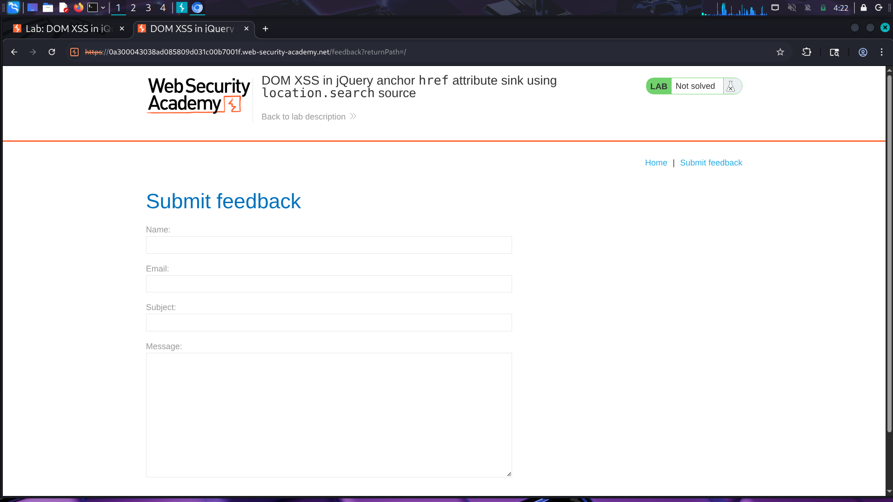
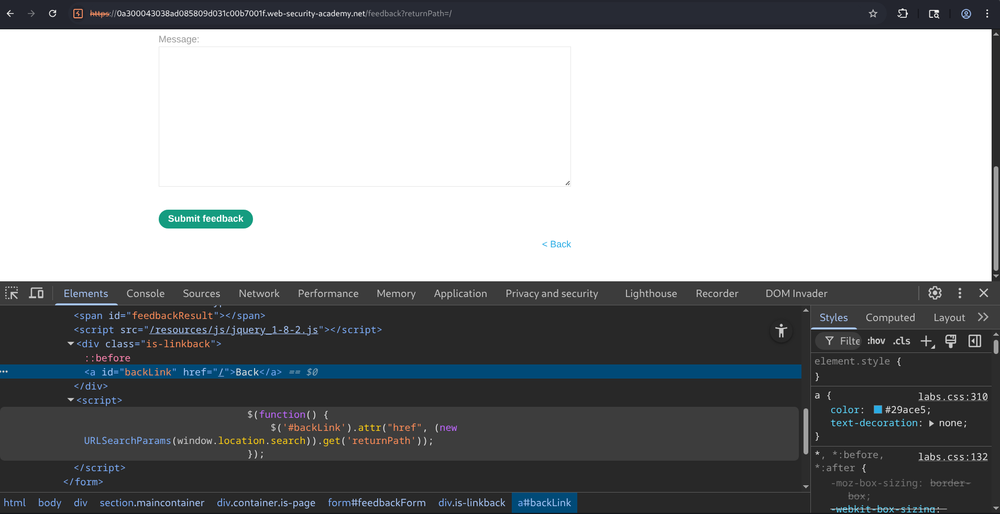
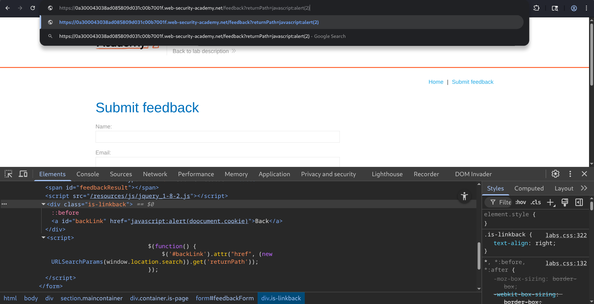
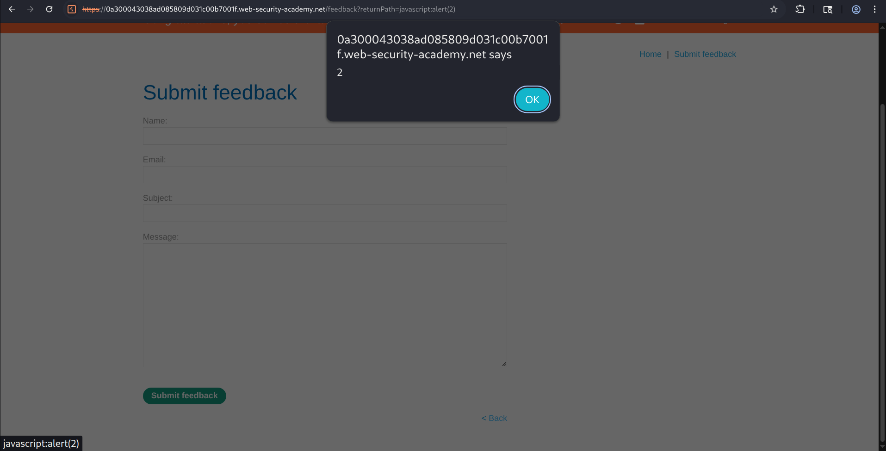
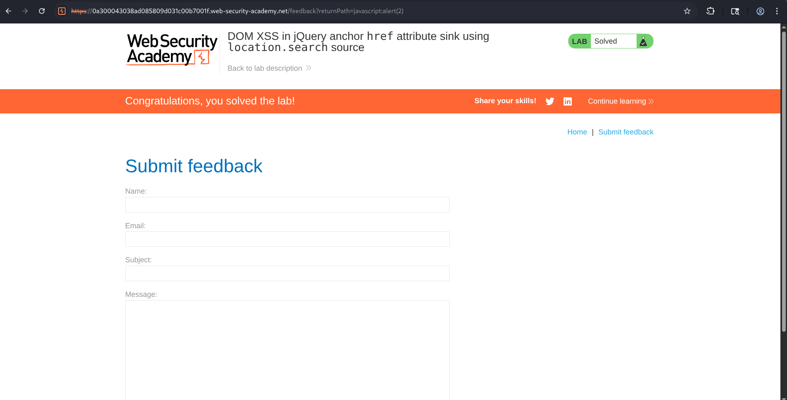

# Lab: DOM XSS in jQuery Anchor `href` Attribute Sink Using `location.search` Source


## Overview

This lab demonstrates a **DOM-based Cross-Site Scripting (DOM XSS)** vulnerability caused by the unsafe use of user-controlled input from the browser URL. The application reads the `returnPath` parameter from `location.search` and directly assigns its value to the `href` attribute of a "Back" hyperlink using jQuery's `.attr()` function without any validation or sanitization.

We can replace the expected navigation path with a `javascript:` URI. When the victim clicks the "Back" link, the browser executes the JavaScript code embedded in the URL instead of navigating to another page.

---

## Objective

- Analyze the client-side JavaScript responsible for creating the Back link.
- Identify the source of user-controlled data.
- Locate the vulnerable jQuery sink.
- Craft a payload that replaces the Back link destination with JavaScript.
- Trigger JavaScript execution through the malicious hyperlink.

---
## Methodology

### Step 1 - Access the Feedback Page

Opened the vulnerable **Submit Feedback** page provided by the lab.



---

### Step 2 - Inspect the Page

Opened Developer Tools and inspected the Back hyperlink.

Located the following JavaScript :

```javascript
$('#backLink').attr(
    'href',
    (new URLSearchParams(window.location.search)).get('returnPath')
);
```

This confirmed :

- Source → `location.search`
- Sink → `.attr("href")`

Since user input controlled the `href` attribute directly, the page was vulnerable.



---

### Step 3 - Replace the Parameter

Modified the URL directly.

Original :

```text
?returnPath=/
```

Modified :

```text
?returnPath=javascript:alert(2)
```



---

### Step 4 - Trigger the Vulnerability

Clicked the **Back** hyperlink.

Instead of navigating to another page, the browser interpreted the hyperlink as executable JavaScript and displayed the alert dialog.

 confirmed successful exploitation of the DOM XSS vulnerability.



---

### Step 5 - Lab Solved

After successfully executing the payload, the lab was marked as solved by PortSwigger.




> ###  Vulnerability Analysis

The page dynamically generates the Back hyperlink using JavaScript :

```javascript
$('#backLink').attr(
    'href',
    (new URLSearchParams(window.location.search)).get('returnPath')
);
```

**Source**

```javascript
window.location.search
```

Reads data directly from the query string.

---

**Sink**

```javascript
.attr("href", value)
```

The retrieved value is assigned directly to the `href` attribute.

---

Since no validation is performed, supplying a value beginning with :

```
javascript:
```

causes the browser to execute JavaScript when the hyperlink is clicked.

---

## Attack Flow

```text
  Attacker
     ⇓
Craft malicious URL
?returnPath=javascript:alert(2)
     ⇓
Victim opens page
     ⇓
JavaScript reads
window.location.search
     ⇓
Extracts returnPath parameter
     ⇓
jQuery assigns it directly
.attr("href", payload)
     ⇓
Back hyperlink now points to
javascript:alert(2)
     ⇓
Victim clicks Back
     ⇓
Browser executes JavaScript
     ⇓
DOM XSS Achieved
```
---

## Impact

A successful attacker may be able to :

- Execute arbitrary JavaScript in the victim's browser
- Steal session cookies (where not protected by HttpOnly)
- Perform actions on behalf of authenticated users
- Redirect victims to malicious websites
- Conduct phishing attacks
- Manipulate page content
- Capture sensitive information
- Chain attacks with other client-side vulnerabilities

---

## Security Recommendations

### ➤ Validate URLs

Accept only approved internal paths,
like..

```text
/home
/profile
/contact
```

Reject any value starting with :

```text
javascript:
data:
vbscript:
```

---

### ➤ Avoid User-Controlled href Values

Do not directly assign user input to:

```javascript
href
src
location
```

without validation.

---

### ➤ Implement URL Allow-Listing

Permit only predefined application routes.

---

### ➤ Validate Protocols

Ensure URLs begin with:

```text
https://
http://
/
```

Reject everything else.

---

### ➤ Apply Content Security Policy (CSP)

A strong CSP can reduce the impact of XSS by preventing execution of unauthorized scripts.

---

### ➤ Sanitize User Input

Never trust values coming from:

- URL parameters
- Hash fragments
- Query strings
- Browser storage

Validate before use.

---

## Conclusion

This lab demonstrated a classic **DOM-Based Cross-Site Scripting** vulnerability caused by trusting data obtained from `location.search`. During testing, the page source was inspected to identify the JavaScript responsible for creating the Back hyperlink. It was observed that the application retrieved the `returnPath` parameter from the URL and directly assigned it to the hyperlink's `href` attribute using jQuery without any validation.

By replacing the original value with the payload `javascript:alert(2)`, the hyperlink became executable JavaScript.

---

**References ~** 

- https://portswigger.net/web-security/cross-site-scripting/dom-based
- https://owasp.org/www-community/attacks/xss/
- https://developer.mozilla.org/en-US/docs/Web/API/URLSearchParams