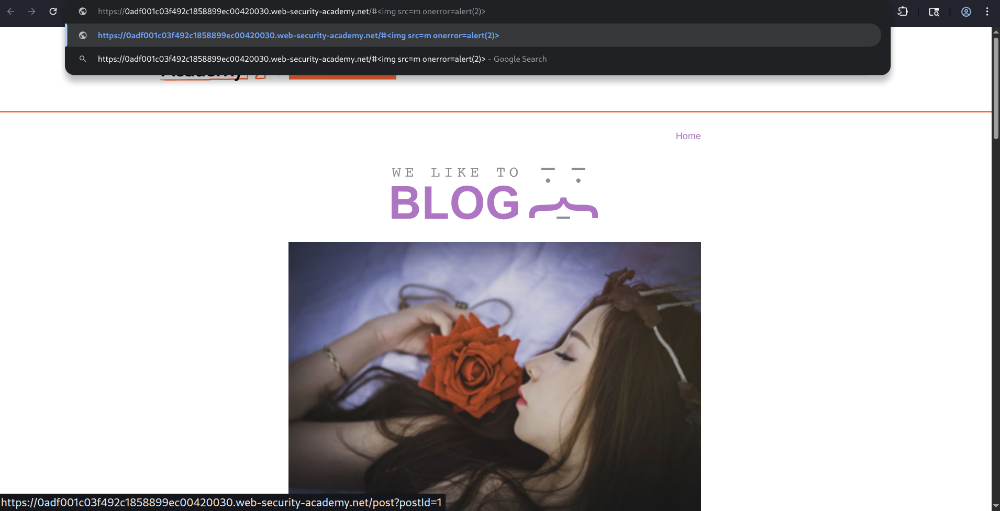
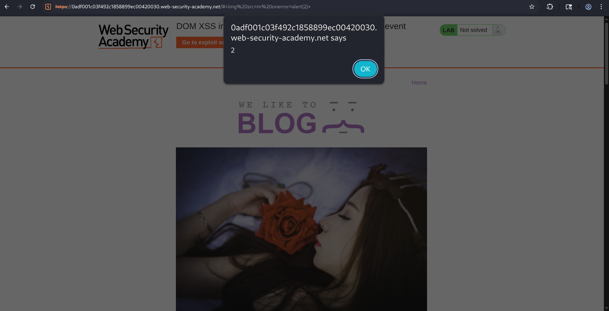
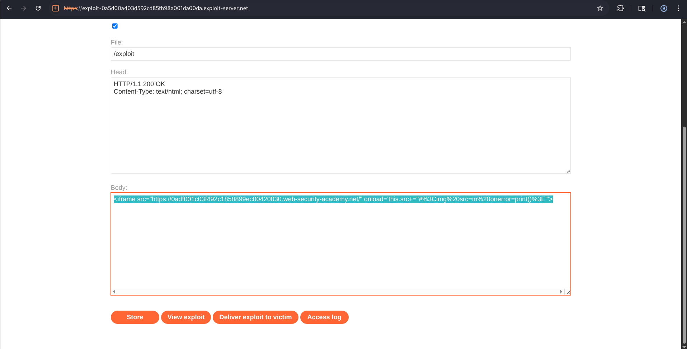
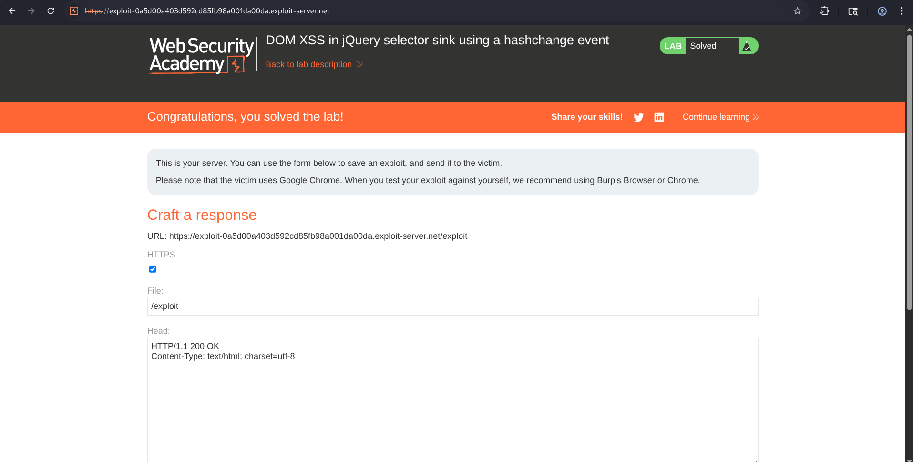

# Lab: DOM XSS in jQuery Selector Sink Using a `hashchange` Event

## Overview

This lab demonstrates a **DOM-Based Cross-Site Scripting (DOM XSS)** vulnerability caused by the unsafe use of a **jQuery selector sink** that processes data from the URL fragment (`location.hash`). The vulnerable JavaScript listens for the **`hashchange`** event and dynamically passes user-controlled input into a jQuery selector without proper sanitization.

The lab also introduces an **exploit server** to deliver a malicious webpage to a simulated victim, illustrating a realistic attack scenario where the victim simply visits an attacker-controlled page.

---

## Objective

The objective of this lab is to :

- Identify a DOM XSS vulnerability caused by a jQuery selector sink.
- Understand how the `hashchange` event can be abused.
- Verify the vulnerability using a proof-of-concept payload.
- Host an exploit on the provided exploit server.
- Deliver the exploit to the victim and successfully solve the lab.

---

## Methodology

### Step 1 - Open the Lab

The lab page was opened and the application loaded successfully.

The objective indicated that the vulnerability involved a **DOM XSS using a jQuery selector sink with a hashchange event**.


---

## Step 2 - Test the URL Fragment

Since the vulnerability involved the URL hash, testing began by modifying the fragment identifier.

```text
#
```

The browser immediately executed the payload.



An alert box displaying :
**2**


confirmed that JavaScript execution was possible through the URL fragment, and this verified the presence of a DOM-based XSS vulnerability.



---

### Step 4 - Create the Exploit

The lab required exploiting a simulated victim using the exploit server. So, I opened the exploit server, and created an HTML page containing an iframe.

The iframe automatically loads the vulnerable page and changes its fragment after loading.


```html
<iframe
src="https://YOUR-LAB-ID.web-security-academy.net/"
onload='this.src+="#%3Cimg%20src=m%20onerror=print()%3E"'>
</iframe>
```
So, the
Encoded payload :

```text
#%3Cimg%20src=m%20onerror=print()%3E
```

which simply is :

```html
#
```

The iframe loads the application.

Once loading finishes :

```javascript
onload
```

updates the fragment, triggering the vulnerable `hashchange` handler, and the application processes the new fragment and executes the injected HTML.



---

### Step 5 – Deliver the Exploit

After storing the exploit :

- **View Exploit** was used for testing.
- The exploit successfully executed.
- **Deliver to Victim** was clicked.

The lab was marked as solved.



And if the victim visit the hosted exploit page, payload will execute automatically.

---

> ###  Vulnerability Analysis

Modern web applications frequently use the URL fragment (`#`) to navigate between sections without reloading the page.


```text
https://example.com/#home
```

JavaScript retrieves this fragment using:

```javascript
location.hash
```

If this value is inserted directly into a jQuery selector:

```javascript
$(location.hash)
```

without validation or sanitization, an attacker can manipulate the fragment so that jQuery interprets it as HTML instead of a selector, resulting in arbitrary JavaScript execution.

The application also listens for the :

```javascript
window.onhashchange
```

Whenever the fragment changes, the vulnerable code executes again, allowing the payload to trigger automatically.

---

## Attack Flow

```text
Victim Visits Attacker Page
            ⇓
Iframe Loads Vulnerable Website
            ⇓
  Iframe onload Executes
            ⇓
  URL Fragment Changes
            ⇓
  hashchange Event Fires
            ⇓
   location.hash Read
            ⇓
Passed into jQuery Selector
            ⇓
  Payload Parsed as HTML
            ⇓
   onerror Executes
            ⇓
    JavaScript Runs
```

---

## Impact

A successful DOM XSS vulnerability may allow an attacker to :

- Execute arbitrary JavaScript in a victim's browser.
- Hijack authenticated user sessions.
- Steal cookies (when not protected by HttpOnly).
- Modify page content.
- Redirect users to malicious websites.

---

## Root Cause

The vulnerability exists because :

- User-controlled input from `location.hash` is trusted.
- The input is passed directly into a jQuery selector.
- No sanitization is applied.
- HTML is interpreted instead of treated as plain text.
- The `hashchange` event automatically reprocesses attacker-controlled input.

---

## Security Recommendations

### ▢ Validate User Input

Never trust values obtained from :

- `location.hash`
- `location.search`
- `document.URL`
- `document.referrer`

---

### ▢ Avoid Passing User Input into jQuery Selectors

Unsafe :

```javascript
$(location.hash)
```

Prefer selecting only expected IDs after validating the format.

---

### ▢ Sanitize Input

Use a trusted sanitization library before inserting user-controlled content into the DOM.

---

### ▢ Implement Content Security Policy (CSP)

A strong CSP can significantly reduce the impact of DOM XSS by blocking inline script execution and restricting trusted script sources.

---

## Conclusion

This lab demonstrated a **DOM-Based Cross-Site Scripting** vulnerability resulting from the unsafe use of a **jQuery selector sink** that processed attacker-controlled data from `location.hash`. By modifying the URL fragment with a crafted HTML payload, arbitrary JavaScript execution was achieved entirely within the browser. 

The exploit was then hosted on the provided exploit server using an iframe that automatically updated the fragment on page load, triggering the vulnerable `hashchange` event. Delivering this exploit to the simulated victim successfully completed the lab, emphasizing the importance of validating client-side inputs, avoiding unsafe DOM manipulation, and implementing secure coding practices to prevent DOM XSS vulnerabilities.
