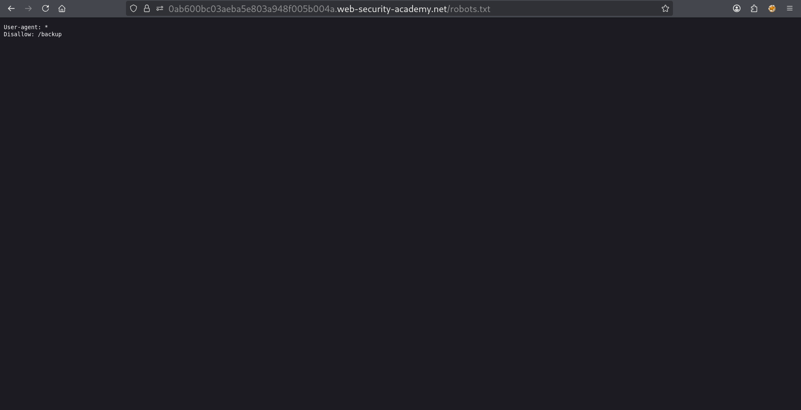
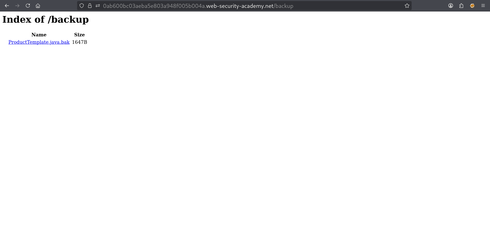
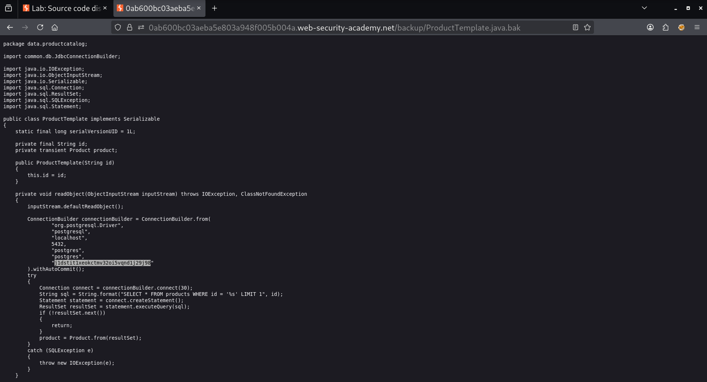

# Lab: Source Code Disclosure via Backup Files

## Lab Overview

This lab demonstrates how sensitive information can be exposed through publicly accessible backup files.

The objective of this lab was to identify a publicly accessible backup file, review its contents, and obtain the database password disclosed within the source code.

---

## Vulnerability Description

Source code disclosure occurs when application source code becomes accessible to unauthorized users. This often happens due to misconfigured servers, exposed backup files, forgotten development resources, or improper deployment practices.

---

## Initial Reconnaissance

The assessment began by reviewing files that are commonly exposed by web applications.

One of the file is:

```text
/robots.txt
```

The `robots.txt` file is intended to provide instructions to different search engine crawlers about which resources should & should not be indexed.

### Screenshot



---

## Discovery of Backup Directory

Upon reviewing the contents of `robots.txt`, a backup directory was identified (the only one thing present there).

This directory appeared to contain development-related resources.

Navigating directly to the disclosed path revealed a backup file containing the application's source code.

### Screenshot



---

## Source Code Analysis

The backup file contained Java source code used by the application.

During analysis, several application components were observed, including references to:

     ⍟ Database connectivity
     ⍟ Application configuration
     ⍟ PostgreSQL database interactions
     ⍟ Authentication-related functionality

### Screenshot



---

## Credential Disclosure

The code contained references to a PostgreSQL database along with authentication details required by the application. And a hardcoded password was present within the source code.

structure:

```java

    ConnectionBuilder connectionBuilder = ConnectionBuilder.from(
            "org.postgresql.Driver",
            "postgresql",
            "localhost",
            5432,
            "postgres",
            "postgres",
            "j1dstit1xeokctmv32oi5vqnd1j29j98"
    ).withAutoCommit();
```

The discovered password was copied and submitted as the solution to the lab.


---

## Exploitation

The exposed backup file provided direct access to the application's source code.

By reviewing the source code, sensitive database credentials were disclosed without requiring authentication or special privileges.

The extracted database password was submitted successfully, resulting in completion of the lab.

### Screenshot


---

## Security Impact

Exposure of source code can have severe consequences for an organization.

Potential risks include:

- Disclosure of database credentials
- Exposure of API keys and secrets
- Discovery of hidden endpoints

---

## Root Cause

The vulnerability existed because a backup file containing application source code was publicly accessible through the web server.


---

## Security Recommendations

To prevent similar vulnerabilities:

     ▤ Remove backup files from publicly accessible directories.

     ▤ Store backups outside the web root.

     ▤ Implement proper access controls on development resources.

     ▤ Conduct regular reviews for exposed files and directories.
     
     ▤ Avoid hardcoding credentials within source code.

---

## Conclusion

This lab demonstrated a source code disclosure vulnerability caused by an exposed backup file. Through simple reconnaissance of the `robots.txt` file, a backup directory was identified and explored. The backup contained Java source code that disclosed sensitive PostgreSQL database credentials. The exposed password was successfully used to solve the lab.

