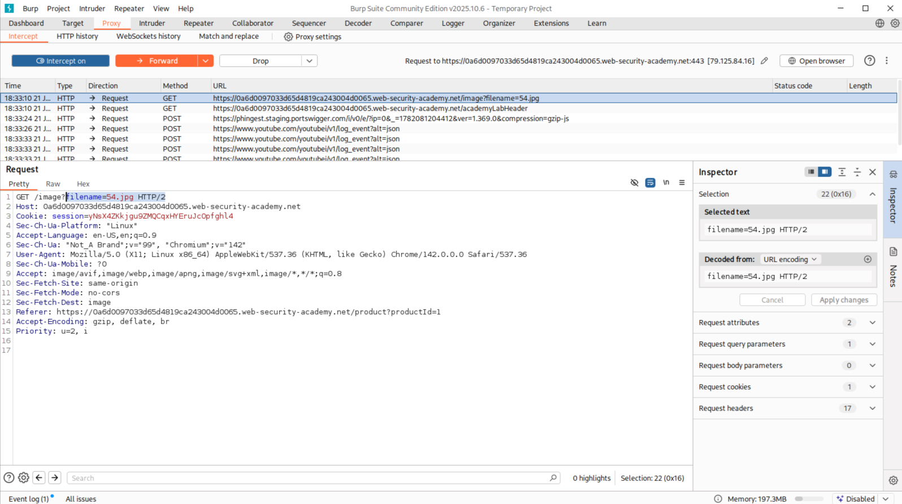
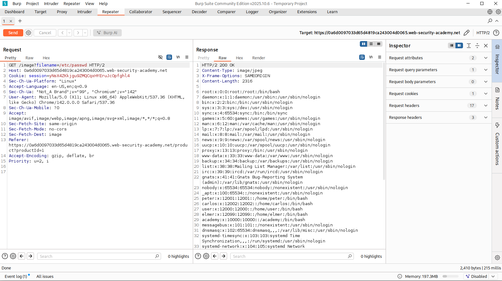
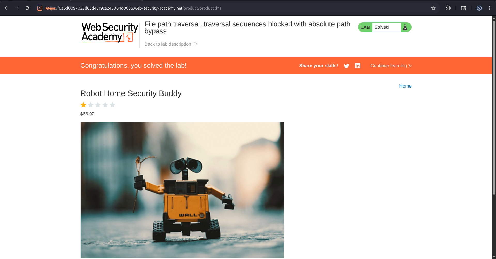

# File Path Traversal - Traversal Sequences Blocked with Absolute Path Bypass

---

## Overview

This lab demonstrates a File Path Traversal vulnerability where common traversal sequences such as `../` are filtered or blocked by the application. 

Although the application attempts to prevent directory traversal attacks, but, fails to properly validate absolute file paths.

As a result, a attacker can bypass the traversal protections by directly supplying an absolute path to sensitive system files, allowing unauthorized file access.

---

## Objective

The objective of this lab was to access the contents of the `/etc/passwd` file by exploiting a path traversal vulnerability in the product image functionality despite traversal sequences being blocked.

---

## Lab Scenario

The application displayed product images through a request of (similar to):

```http
GET /image?filename=54.jpg
```

The lab description suggested that traversal sequences were blocked, indicating that the traditional payloads like `../../../etc/passwd` would likely be filtered.

---

## Methodology

### Step 1: Identify the Vulnerable Parameter

After opening the application, I intercepted the request responsible for loading product images using Burp Suite Proxy.

which was :

```http
GET /image?filename=54.jpg
```

And since the filename parameter controlled the file being loaded from the server, it became the primary attack target.

---

### Step 2: Send Request to Repeater

The intercepted request was sent to Burp Repeater for manual testing.

This allowed modification of the filename parameter without repeatedly interacting with the actual practise interface.




---

### Step 3: Test Absolute Path Bypass

Since the lab title suggested traversal sequences were blocked, instead of using traditional payloads such as:

```text
../../../etc/passwd
```

I replaced the image filename with an absolute Linux path:

```http
GET /image?filename=/etc/passwd
```

---

### Step 4: Verify Sensitive File Disclosure

Then, the server responded successfully and returned the contents of the Linux password file(passwd).

The response included multiple system accounts such as:

```text
root:x:0:0:root:/root:/bin/bash
daemon:x:1:1:daemon:/usr/sbin:/usr/sbin/nologin
peter:x:1200:1200:/home/peter:/bin/bash
carlos:x:1202:1202:/home/carlos:/bin/bash
```

This confirmed that the application accepted absolute file paths and allowed arbitrary file disclosure.




---

### Step 5: Complete the Lab

After confirming successful retrieval of the `/etc/passwd` file, I forwarded the modified request (closed intercepting) and refreshed the application.

The lab was immediately marked as solved.



---

## Attack Flow

```text
User Visits Product Page
            ⇓
Product Image Request Identified
            ⇓
GET /image?filename=54.jpg
            ⇓
Request Sent to Repeater
            ⇓
Filename Modified
            ⇓
       /etc/passwd
            ⇓
Application Accepts Absolute Path
            ⇓
Server Reads Sensitive File
            ⇓
Contents Returned to Attacker
            ⇓
        Lab Solved
```

---

## Impact

### ▥ Sensitive File Disclosure

Attackers can access files outside the intended application directory.

like:

```text
/etc/passwd
/etc/shadow
/etc/hosts
```

---

### ▥ Configuration Exposure

Sensitive application files may contain:

- Database credentials
- API keys
- Internal service accounts
- Cloud authentication tokens

---

### ▥ Source Code Disclosure

Attackers may obtain:

- Application source code
- Security logic
---

### ▥ Increased Attack Surface

Information obtained through file disclosure can facilitate:

- Privilege escalation
- Authentication bypass
- Remote code execution
- Further penetration of the environment

---

## Security Recommendations

### ⫸ Restrict File Access to Intended Directory

All file requests should remain inside the designated image directory.

Example:

```text
/var/www/images/
```

Any attempt to access files outside this directory should be rejected.

---

### ⫸ Use the Canonical Path Validation

Resolve the final file path before accessing it.

Like:

**realpath()**


Verify that the resolved path remains within the expected directory.

---

### ⫸ Block Absolute Paths

Reject requests containing:

```text
/etc/passwd
C:\Windows\
/root/
/home/
```

---

### ⫸ Secure File Handling

Never directly pass user input into filesystem operations. Instead, map the user's of it selections to predefined files.

---

## Conclusion

In this lab, the File Path Traversal vulnerability was successfully exploited despite traversal sequences being blocked by the application. By directly supplying the absolute path `/etc/passwd`, it was possible to bypass the application's traversal protections and access sensitive system files.

The vulnerability existed cuz the application focused on filtering traversal sequences while failing to validate the absolute paths.