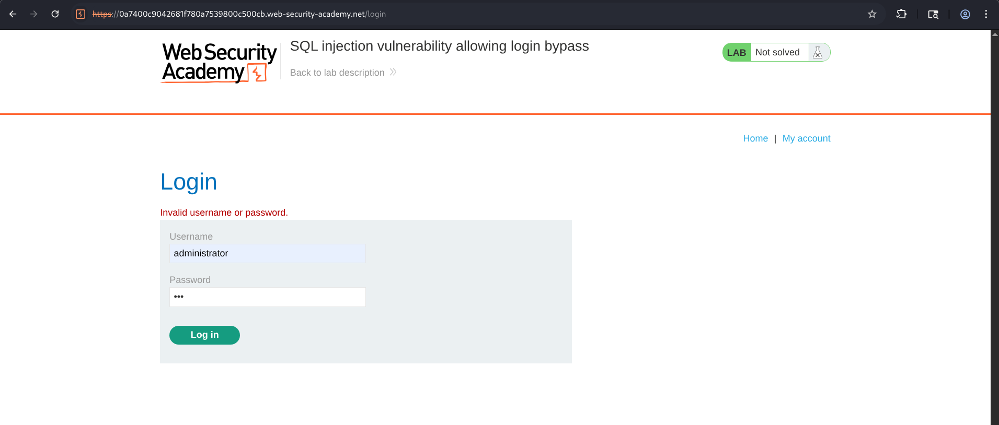
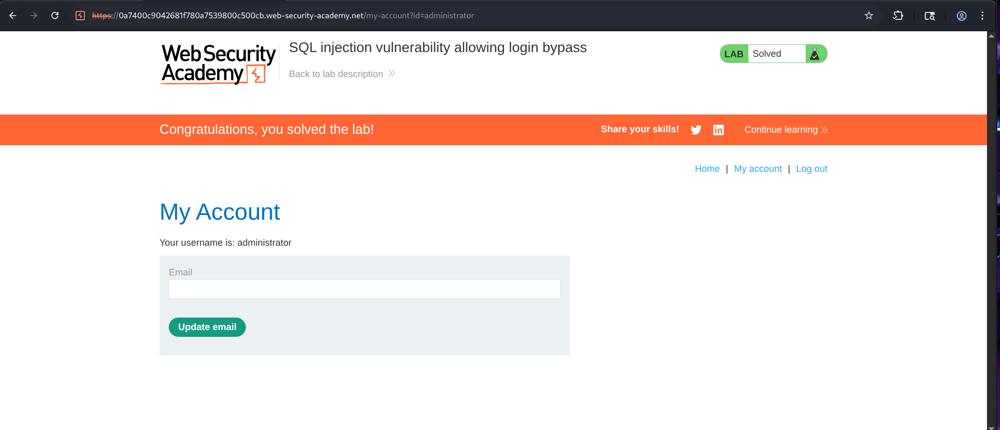

# SQL Injection Vulnerability Allowing Login Bypass


## Overview

This lab demonstrates one of the most common and dangerous SQL Injection vulnerabilities—**authentication bypass**. The login functionality fails to properly sanitize user input before incorporating it into an SQL query, allowing an attacker to manipulate the query logic.

Instead of supplying a valid password, a crafted SQL payload is injected into the password field. The injected condition evaluates to **TRUE**, causing the database to authenticate the user without verifying the actual password.

In this lab, the application authenticated the attacker as the **administrator** account, resulting in complete administrative access and successfully solving the lab.

---

## Objective

The objective of this lab was to:

- Identify a SQL Injection vulnerability in the login form.
- Test how the application handles invalid credentials.
- Inject SQL syntax into the authentication query.
- Bypass password verification.
- Gain unauthorized access as the administrator.
- Successfully complete the lab.

---
## Methodology

### Step 1 - Testing Normal Login Behavior

The first step was simply understanding how the login page behaved with invalid credentials.

The following credentials were entered :

**Username**

> administrator


**Password**

> abc


The application responded with :

```
Invalid username or password.
```

This confirmed that normal authentication was functioning as expected.

---



---

### Step 2 - Testing for SQL Injection

Since login forms are common targets for SQL Injection, the password field was tested with a simple authentication bypass payload.

The username remained unchanged :

> administrator


The password was replaced with:

```sql
' OR 1=1--
```

The application immediately authenticated the session, No valid administrator password was required.

This confirmed that the password parameter is vulnerable to SQL Injection.

---

**Working of the payload**

The injected payload closes the original password string and appends a condition that always evaluates to **TRUE**.

Example :

Original SQL query :

```sql
SELECT * FROM users WHERE username='administrator' AND password='abc';
```

Injected password :

```sql
' OR 1=1--
```

Resulting SQL query :

```sql
SELECT * FROM users WHERE username='administrator' AND password='' OR 1=1--;
```

The condition :
> 1=1

is always true.

The double hyphen (`--`) comments out, remainder of the original SQL statement, preventing the database from evaluating the rest of the query.

As a result, the authentication check succeeds even though no valid password was supplied.

---

### Step 3 - Successful Authentication

After submitting the malicious payload, the application authenticated the session as :

```
administrator
```

The administrator account page became accessible, and the lab was marked as solved.

---



---

## Attack Flow

```
 User accesses Login Page
           ⇓
Application requests Username and Password
           ⇓
Attacker enters administrator as Username
           ⇓
Password field receives SQL Injection payload
           ⇓
  SQL query is modified
           ⇓
Injected condition evaluates TRUE
           ⇓
Password verification bypassed
           ⇓
Authenticated as Administrator
           ⇓
Administrative Access Granted
```

---

## Security Impact

This vulnerability holds the potential that could allow attackers to:

- Completely bypass authentication.
- Gain administrator privileges.
- Access sensitive user information.
- Modify application data.
- Delete records.
- Change passwords.
- Escalate privileges.

---

## Security Recommendations

### 1. Use Parameterized Queries

Prepared statements ensure that user input is treated strictly as data rather than executable SQL code.

---

### 2. Never Concatenate User Input into SQL Queries

Avoid constructing authentication queries using string concatenation, use the prepared statements with bound parameters.

---

### 3. Escape Special Characters

If parameterized queries cannot be used (legacy systems), properly escape SQL metacharacters.

---

### 4. Use Least-Privilege Database Accounts

The application's database account should have only permissions required for authentication and routine operations.

---

### 5. Generic Authentication Errors

Avoid revealing unnecessary information during failed login attempts.

just return generic messages like :

```
Invalid username or password.
```

instead of indicating which field was incorrect.

---

## Conclusion

This lab demonstrated a classic **SQL Injection authentication bypass** vulnerability. By testing the login form with invalid credentials and then injecting the payload `' OR 1=1--` into the password field, it was possible to manipulate the backend SQL query and bypass password verification entirely. The application authenticated the session as the **administrator**, granting unauthorized administrative access and successfully solving the lab.