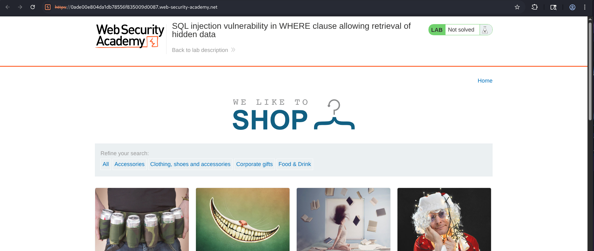
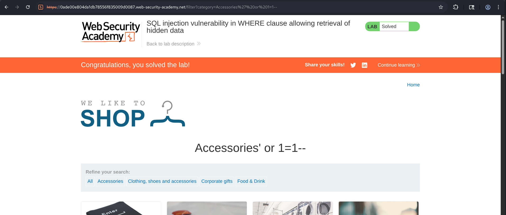

# SQL Injection Vulnerability in WHERE Clause Allowing Retrieval of Hidden Data


## Overview

This lab demonstrates a classic **SQL Injection vulnerability** in a `WHERE` clause that allows an attacker to manipulate the application's SQL query and retrieve hidden data.

By injecting a condition that always evaluates to **TRUE**, the attacker bypasses the intended filtering conditions and forces the application to return every product in the database, including products that were meant to remain hidden.

---

## Objective

The objective of this lab was simply :

- Identify a SQL Injection vulnerability in the product category filter.
- Understand how the application's SQL query filters products.
- Inject SQL syntax into the vulnerable parameter.
- Bypass the intended `WHERE` clause restrictions.
- Retrieve hidden products from the database.
- Successfully solve the lab.

---

## Methodology

### Step 1 - Exploring the Application

The lab began by browsing the shopping application and exploring different product categories to understand how products were filtered.

The available categories included:

- Gifts
- Lifestyle
- Accessories
- Food & Drink
- Pets

Selecting different categories changed the products displayed on the page, indicating that the selected category was being used within a backend SQL query.

---



---

### Step 2 - Identifying the Injection Point

Among the categories, I choosed  **Accessories** category was selected for testing.

Since category filters are commonly vulnerable to SQL Injection, a simple payload was appended to the category value.

Injected payload:

> ' OR 1=1--


Resulting parameter:

```text
Accessories' OR 1=1--
```

The payload was submitted by modifying the request parameter.


---

### Step 3 - Understanding the Injection

The application normally executes a query similar to:

```sql
SELECT * FROM products WHERE category='Accessories' AND released=1;
```

After injecting:

```sql
' OR 1=1--
```

the SQL query becomes:

```sql
SELECT * FROM products WHERE category='Accessories' OR 1=1--;
```

The injected condition:

> 1=1


always evaluates to **TRUE**.

The SQL comment sequence:  
> **--**

comments out the remainder of the original query, including any additional filtering conditions such as:

```sql
AND released=1
```

As a result, every row in the products table satisfies the query.

---

### Step 4 - Retrieving Hidden Products

Once the injected query executed successfully, the application displayed all products stored in the database.

Products that were previously hidden or unpublished also became visible.

The application detected the successful retrieval of hidden data and automatically marked the lab as solved.

---



---

## Attack Flow

```text
User Opens Shopping Application
            ⇓
Selects Accessories Category
            ⇓
Application Sends category Parameter
            ⇓
Attacker Injects SQL Payload
(' OR 1=1--)
            ⇓
  SQL Query is Modified
            ⇓
WHERE Clause Always Evaluates TRUE
            ⇓
Category Filtering Removed
            ⇓
Hidden Products Retrieved
            ⇓
       Lab Solved
```

---

## Security Impact

A successful attack against this vulnerability could allow attackers to:

- Retrieve hidden or unpublished products.
- Access confidential records.
- Bypass application filtering logic.
- Enumerate sensitive database information.
- Discover internal business data.
- Use the vulnerability as a stepping stone for more advanced SQL Injection attacks.

Although this lab focuses on hidden products, similar vulnerabilities in production systems could expose customer information, financial records, internal documents, or administrative data.

---

## Root Cause

The vulnerability exists because:

- User input is directly concatenated into the SQL query.
- The application trusts client-supplied input.
- No parameterized queries are used.
- SQL metacharacters are interpreted as executable SQL.
- Filtering logic relies entirely on user-controlled data.

---

## Security Recommendations

### 1. Use Parameterized Queries

Prepared statements separate SQL logic from user input, preventing attackers from modifying query structure.

---

### 2. Avoid Dynamic SQL Construction

Never concatenate user input directly into SQL statements.

Instead of:

```sql
SELECT * FROM products WHERE category=' " + category + " '
```

Use parameterized statements with bound variables.

---

### 3. Validate User Input

Only allow expected category values through server-side validation or whitelisting.

Like :

- Accessories
- Gifts
- Lifestyle
- Pets

Reject any unexpected input.

---

### 4. Apply Least-Privilege Database Permissions

The application should only have permission to access the required tables and data necessary for normal operation.

---

### 5. Hide SQL Errors

Do not expose SQL-related errors or debugging information to users.

---

### 6. Implement a Web Application Firewall (WAF)

A WAF can detect and block common SQL Injection patterns before they reach the application.

---

## Conclusion

This lab demonstrated a **SQL Injection vulnerability within a WHERE clause** that allowed retrieval of hidden application data. By exploring the product categories and injecting the payload `' OR 1=1--` into the **Accessories** category parameter, the original filtering logic was altered, causing the SQL query to return every product in the database instead of only the intended category. 

This included products that were meant to remain hidden, successfully completing the lab.
