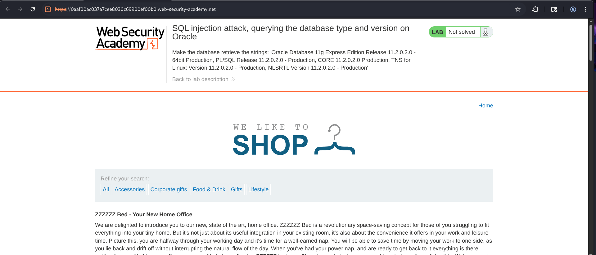
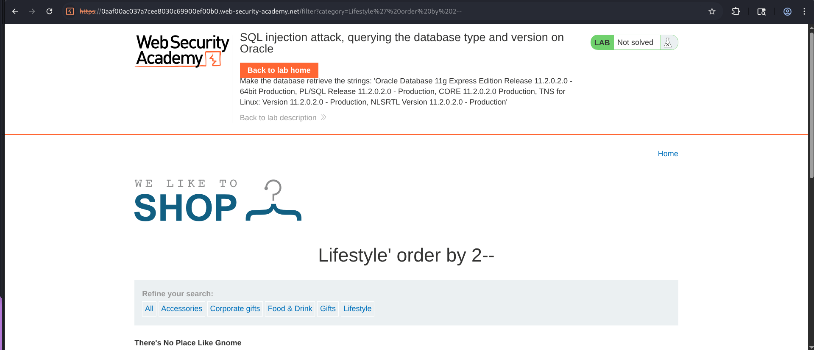
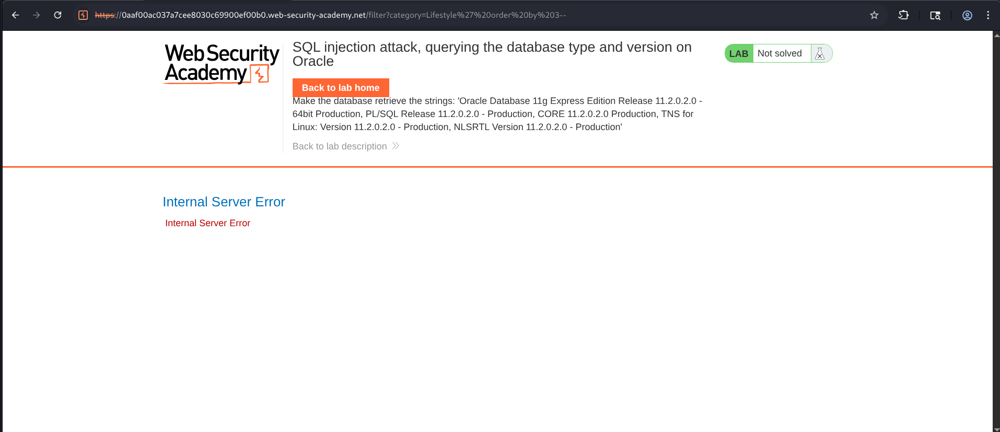

# SQL Injection Attack, Querying the Database Type and Version on Oracle

## Overview

This lab demonstrates how a **UNION-based SQL Injection** vulnerability can be used to identify the backend database management system and retrieve its version information.

By determining the database platform, an attacker can craft payloads that are specific to that database engine.

In this lab, the vulnerable `category` parameter allowed the execution of a UNION query. After determining the correct number of columns, an Oracle-specific query was used to retrieve version information from the `v$version` system view. 

---

## Objective

The objective of this lab was to:

- Identify a SQL Injection vulnerability in the `category` parameter.
- Determine the number of columns returned by the original query.
- Identify the backend database as Oracle.
- Retrieve database version information using an Oracle system view.
- Successfully complete the lab.

---

## Methodology

### Step 1 - Exploring the Application

I started with browsing the shopping application and interacting with the available product categories.

The product categories included :

- Accessories
- Corporate Gifts
- Food & Drink
- Gifts
- Lifestyle

And then selecting different categories changed the displayed products, indicating that the selected category was being incorporated into a backend SQL query.

---


---

### Step 2 - Determining the Number of Columns

Before performing a UNION attack, the number of columns returned by the original SQL query needed to be identified.

So, as usual....

```sql
' ORDER BY 2--
```

The page continued functioning normally, indicating that at least two columns existed.

---

```sql
' ORDER BY 3--
```
responded with an internal server error, indicates that the original query returned only **two columns**.


---




---

### Step 3 - Querying the Oracle Database Version

After confirming the number of columns, a UNION SELECT statement was constructed.

Oracle stores version information inside the dynamic performance view:

```sql
v$version
```

So, 

```sql
' UNION SELECT banner, NULL FROM v$version--
```

Since the original query returned two columns, this payload also returned two values:

- `banner`
- `NULL`

The first column displayed the Oracle version information, while the second column matched the required column count.

---

### Step 4 - Retrieving Database Version Information

After executing the payload, the application displayed multiple Oracle version banners, includin,

```text
Oracle Database 11g Express Edition Release 11.2.0.2.0
```

Additional version details includes :

- CORE 11.2.0.2.0 Production
- PL/SQL Release 11.2.0.2.0
- TNS for Linux
- NLSRTL Version 11.2.0.2.0

Successfully retrieving this information completed the lab.

---


---

## Attack Flow

```text
User Opens Shopping Application
            ⇓
Selects Product Category
            ⇓
Identifies SQL Injection Point
            ⇓
Determines Number of Columns
Using ORDER BY
            ⇓
Confirms Two Returned Columns
            ⇓
Constructs UNION SELECT Payload
            ⇓
Queries Oracle System View
(v$version)
            ⇓
Database Returns Version Information
            ⇓
Oracle Database Identified
            ⇓
        Lab Solved
```
---

## Security Impact

If exploited in a production environment, this vulnerability could allow attackers to...

- Identify the backend database platform.
- Determine the database version.
- Tailor future SQL Injection payloads specifically for Oracle.
- Enumerate database objects.
- Identify known vulnerabilities affecting the detected version.
- Facilitate privilege escalation or further exploitation.

Although version disclosure alone may appear harmless, it significantly improves an attacker's ability to perform targeted attacks against the application and database.

---

## Security Recommendations

### 1. Use Parameterized Queries

Prepared statements ensure user input is treated strictly as data rather than executable SQL.

---

### 2. Avoid Dynamic SQL Construction

Never concatenate user-controlled values directly into SQL statements.

Instead of:

```sql
SELECT name, description
FROM products
WHERE category = '" + category + "'
```

Use prepared statements with bound parameters.

---

### 3. Validate User Input

Restrict category values to an approved whitelist.

Example:

- Accessories
- Lifestyle
- Gifts
- Food & Drink

Reject any unexpected input.

---

### 4. Apply Least-Privilege Database Permissions

The application's database account should not have unnecessary access to Oracle system views unless required.

---

### 6. Deploy a Web Application Firewall (WAF)

A WAF can detect and block common SQL Injection payloads before they reach the application.

---

### 7. Perform Regular Security Assessments

Conduct secure code reviews, vulnerability scanning, and penetration testing to identify SQL Injection flaws before deployment.

---

## Conclusion

This lab demonstrated a **UNION-based SQL Injection attack** used to identify the backend database type and retrieve its version information.

After exploring the application, the number of columns returned by the vulnerable query was determined using `ORDER BY` testing. With the correct column count identified, the Oracle-specific payload `' UNION SELECT banner, NULL FROM v$version--` was executed, successfully retrieving detailed version information from the `v$version` system view and completing the lab.