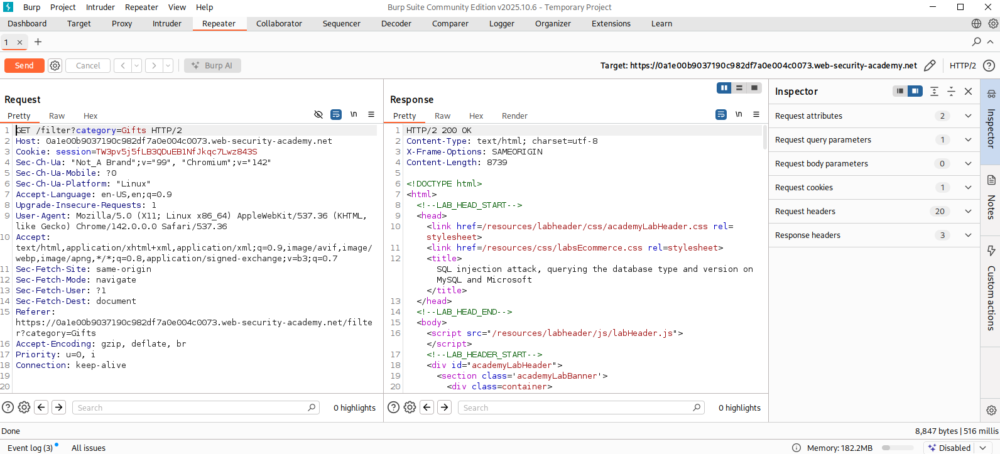
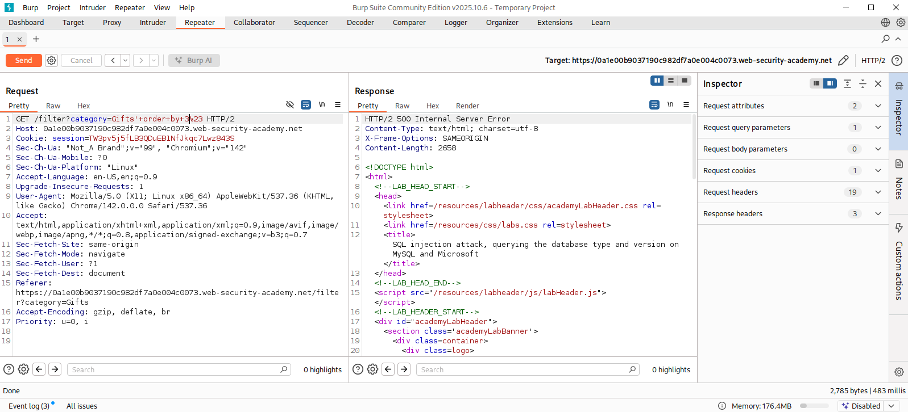
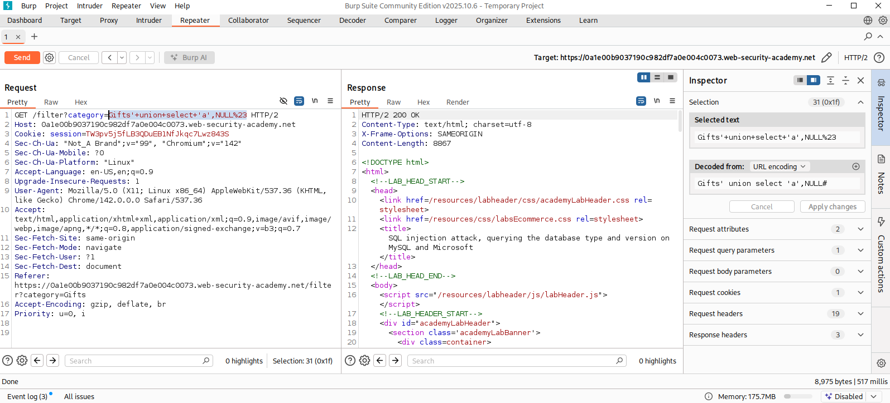
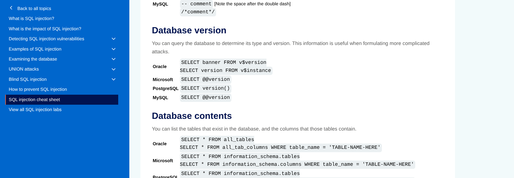

# Lab Report: SQL Injection Attack - Querying the Database Type and Version on MySQL and Microsoft

## Overview

This lab demonstrates how a SQL Injection vulnerability can be used to identify the underlying Database Management System (DBMS) and retrieve its version information.

The vulnerable `category` parameter was exploited using **UNION-based SQL Injection**. 

---

## Objective

The objectives of this lab was...

- Identify a SQL Injection vulnerability.
- Determine the number of columns returned by the SQL query.
- Determine the underlying database platform.
- Retrieve the database version using a UNION SELECT attack.

---
## Methodology

### Step 1 - Intercepting the Request

The application filters products based on the `category` parameter.

The request was intercepted using Burp Suite and forwarded to **Repeater** for manual testing.

that is :

```
GET /filter?category=Gifts HTTP/2
```

---


---

### Step 2 - Determining the Number of Columns

The first obvious task was to identify how many columns were returned by the original SQL query.

```
' ORDER BY 2--
```

The request executed successfully, indicating that column 2 existed.

Next,

```
' ORDER BY 3--
```

generated an Internal Server Error.

Which confirm, the original query contained **two columns**.


**Total Columns = 2**


---





---

### Step 3 - Testing UNION SELECT

After identifying the column count, a UNION SELECT statement was attempted.

Payload:

```
' UNION SELECT 'a',NULL#
```

The application executed successfully.

This confirmed that:

- Two columns exist.
- The first column accepts string data.
- UNION SELECT injection is possible.

---


---

### Step 4 - Identifying the Database Platform

To determine which SQL syntax should be used for version enumeration, the PortSwigger SQL Injection Cheat Sheet was given in description hint.

which says,

For **MySQL**

```
SELECT @@version
```

For **Microsoft SQL Server**

```
SELECT @@version
```

---



---

### Step 5 - Retrieving the Database Version

Since both databases support `@@version`, the payload was modified to retrieve the version string.

Payload used:

```
' UNION SELECT 'a',@@version#
```

The response displayed the complete database version information, which confirmed the underlying DBMS and completed the lab objective.

---

The retrieved information confirmed the database type and version, successfully solving the PortSwigger lab.

---


---

## Attack Flow

```
Locate injectable parameter
           ⇓
   Intercept request
           ⇓
Determine column count
           ⇓
Find printable string column
           ⇓
Identify database platform
           ⇓
Retrieve database version
           ⇓
     Lab Solved
```
---

## Security Impact

If exploited in a real-world application, this vulnerability could expose :

- Database software type
- Database version
- Patch level
- Database vendor
- Internal configuration details

---

## Security Recommendations

To mitigate SQL Injection vulnerabilities :

- Use parameterized (prepared) SQL statements.
- Never concatenate user input directly into SQL queries.
- Validate and sanitize all user-supplied input.
- Disable detailed database error messages.
- Use ORM frameworks that automatically parameterize queries.
- Perform regular code reviews and penetration testing.
- Deploy a Web Application Firewall (WAF) to detect SQL Injection attempts.

---

## Conclusion

This lab demonstrated how a UNION-based SQL Injection vulnerability can be leveraged to determine both the type and version of the underlying database. By first identifying the correct number of columns with `ORDER BY`, and querying `@@version`, the database platform was successfully fingerprinted.

Which, highlights how seemingly minor SQL Injection vulnerabilities can expose critical environmental information that enables attackers to craft more targeted and effective attacks.

---