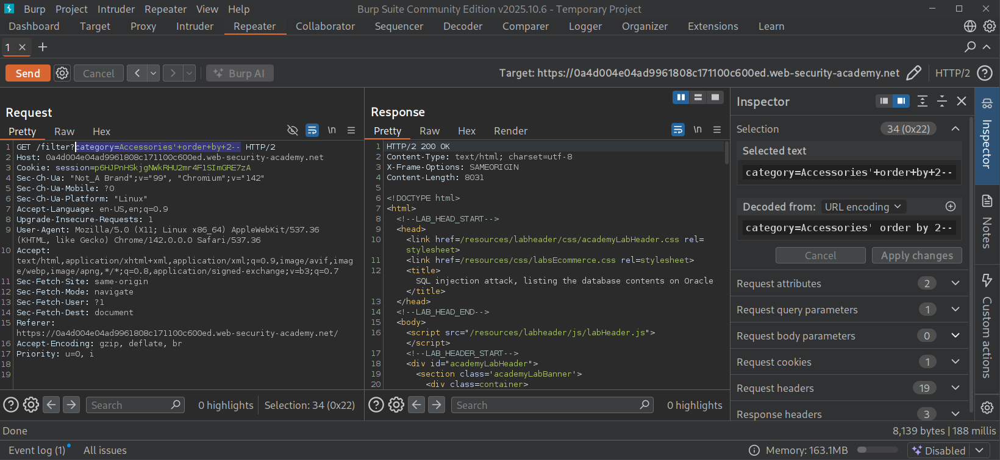
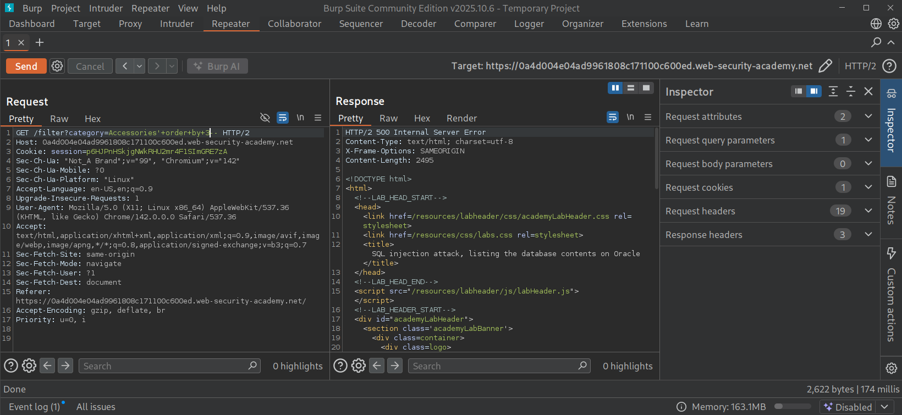
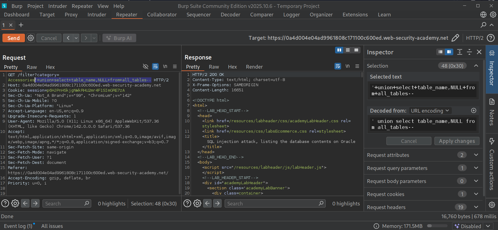
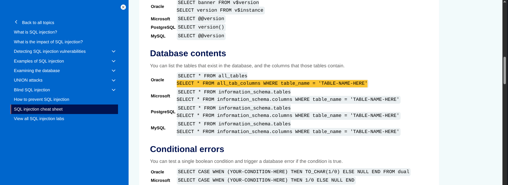
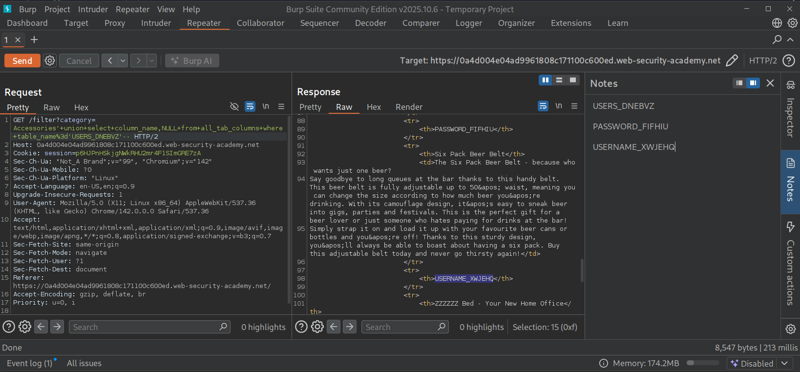
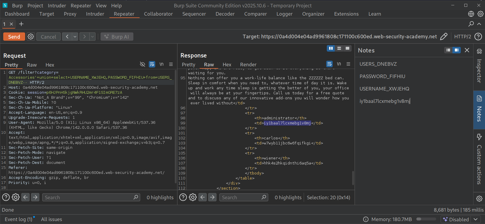

# SQL Injection Attack - Listing the Database Contents on Oracle

## Overview

This lab demonstrates how a SQL Injection vulnerability can be exploited to enumerate the contents of an Oracle database. After confirming that the application is vulnerable to UNION-based SQL Injection,

I  systematically discovers the available tables, identifies the relevant database table containing user credentials, extracts the column names, and finally retrieves usernames and passwords stored within the database.

---

## Objective

The objectives of this lab were :

- Enumerate database tables using Oracle metadata.
- Discover the table containing user credentials.
- Enumerate columns inside the identified table.
- Extract usernames and passwords.
- Login as the administrator using the retrieved credentials.

---

## Methodology

### Step 1 - Verify SQL Injection

The product category parameter was modified to determine whether SQL syntax was being interpreted.


And the response confirmed that injected SQL statements were executed.

---

### Step 2 - Determine Number of Columns

The ORDER BY technique was used.


```sql
' ORDER BY 2--
```

Testing the next column generated an internal server error :

```sql
' ORDER BY 3--
```

---



This confirmed that the original query contained exactly **2 columns**.

---

### Step 3 - Enumerate Database Tables

Oracle stores table information inside:

> ALL_TABLES


So, I put the Payload :

```sql
' UNION SELECT table_name,NULL FROM all_tables--
```

and the response displayed numerous table names.
Among them was a randomly generated table containing user information :

```
USERS_DNEBVZ
```
---


---

### Step 4 - Enumerate Table Columns

Once the table name was identified, Oracle's metadata table was queried.



```sql
' UNION SELECT column_name,NULL FROM all_tab_columns WHERE table_name='USERS_DNEBVZ'--
```

and with that, the response revealed two important columns :

```
USERNAME_XWJEHQ

PASSWORD_FIFHIU
```

These are clearly stored usernames and passwords.

---



---

### Step 5 - Extract User Credentials

With both table and column names identified, the stored credentials were retrieved.

then..

```sql
' UNION SELECT USERNAME_XWJEHQ,PASSWORD_FIFHIU FROM USERS_DNEBVZ--
```

The application returned all usernames along with their corresponding passwords.

---



---

### Step 6 - Login as Administrator

The extracted administrator credentials were used to authenticate into the application.

Successful authentication completed the lab.

---

After successful login, the Web Security Academy confirmed completion.

---


---

## Attack Flow

```
  User Input
      ⇓
SQL Injection Identified
      ⇓
Determine Number of Columns
      ⇓
Verify UNION Injection
      ⇓
Enumerate ALL_TABLES
      ⇓
Locate User Table
      ⇓
Enumerate ALL_TAB_COLUMNS
      ⇓
Locate Username & Password Columns
      ⇓
Extract Credentials
      ⇓
Login as Administrator
      ⇓
 Lab Solved
```

---

## Impact

A successful attacker could :

- Enumerate all database tables.
- Discover hidden database structures.
- Extract usernames.
- Extract passwords.
- Access confidential business information.
- Perform privilege escalation.

---

## Security Recommendations :

### ▥ Use Parameterized Queries

Never concatenate user input into SQL statements.

---

### ▥ Input Validation

Reject unexpected characters and malformed input before processing.

---

### ▥ Principle of Least Privilege

Application accounts should not have permission to query Oracle metadata tables unnecessarily.

---

### ▥ Web Application Firewall (WAF)

Deploy a WAF capable of detecting SQL Injection attempts.

---

### ▥ Continuous Security Testing

Perform regularly :

- Penetration testing
- Code reviews
- Automated vulnerability scanning

---

## Conclusion

This lab demonstrated how a UNION-based SQL Injection vulnerability can be leveraged to systematically enumerate an Oracle database. By first identifying the number of query columns, querying Oracle metadata tables, and finally extracting sensitive credentials, it was possible to gain unauthorized access to the administrator account.